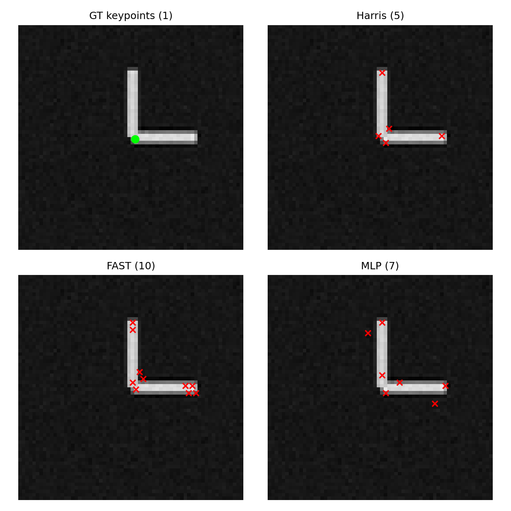
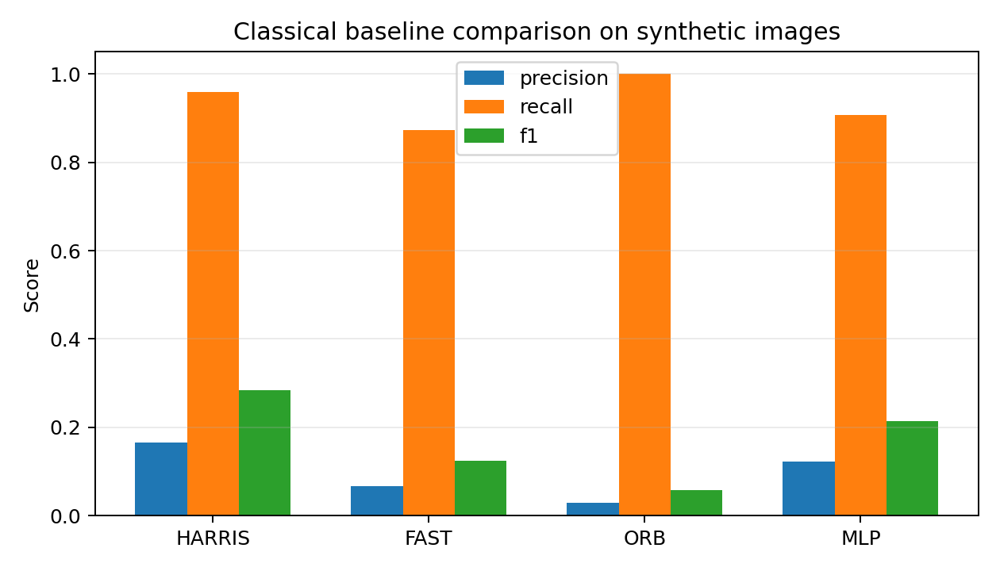
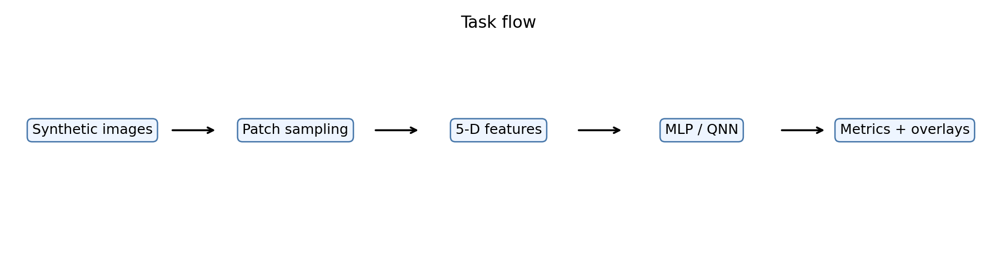
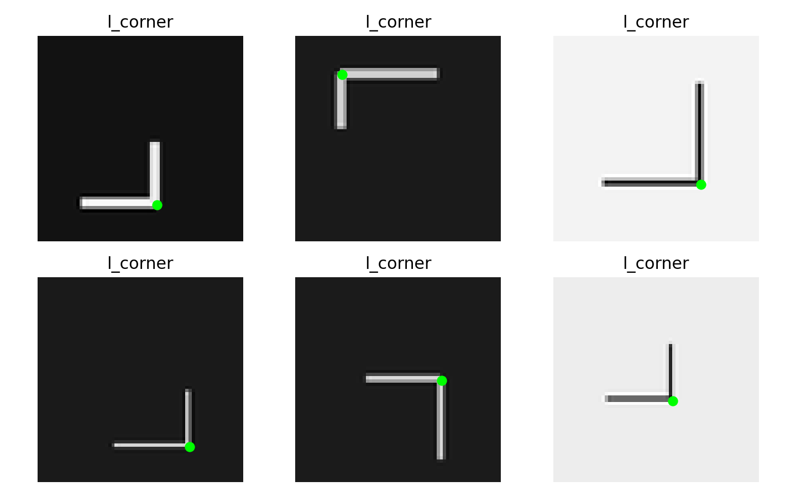
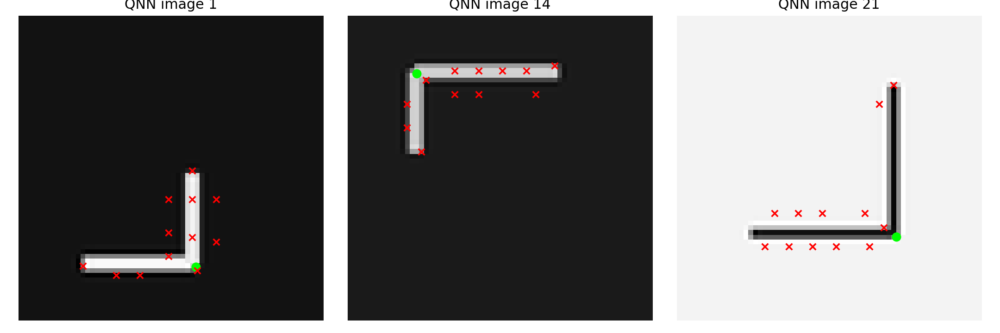
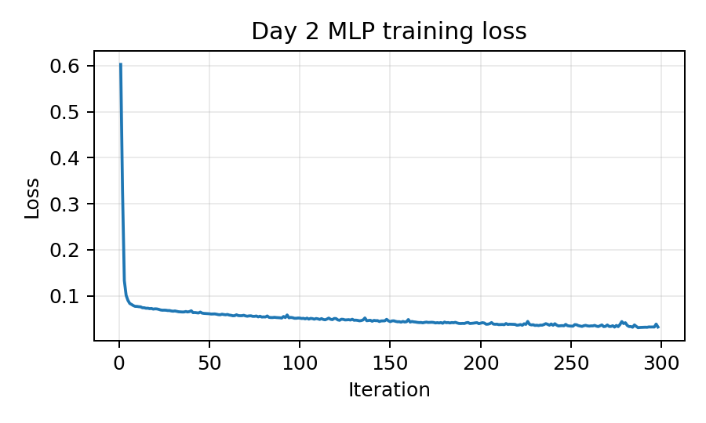
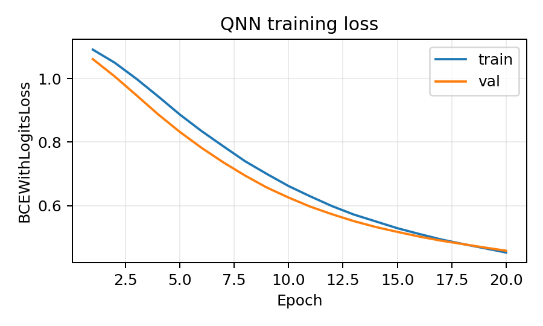

# 当前阶段结果展示汇总

更新时间：2026-06-27

## 1. 项目当前状态

本项目已经完成从合成角点/交点数据到经典 baseline、MLP baseline、QNN 第一轮训练与可视化的最小闭环。

当前 pipeline：

```text
合成几何图像
-> ground-truth keypoints
-> patch 采样
-> 5-D structure tensor features
-> Harris / FAST / ORB image baselines
-> MLP baseline
-> QNN baseline
-> 指标表与 overlay 可视化
```

Day 2 统一特征接口采用计划书推荐的 5 维输入：

```text
[Ix, Iy, lambda1, lambda2, R]
```

其中 MLP 与 QNN 使用同一份 `data/feature_dataset.npz`。当前数据划分为：

| Split | Shape | Feature Dim |
| --- | ---: | ---: |
| `X_train` | `(4500, 5)` | 5 |
| `X_val` | `(1500, 5)` | 5 |
| `X_test` | `(1500, 5)` | 5 |

## 2. Day 1 经典 Baseline

Day 1 主要完成合成数据、patch 采样、9 维早期特征、Harris / FAST / ORB / MLP 的第一版展示。

| Method | Precision | Recall | F1 |
| --- | ---: | ---: | ---: |
| Harris | 0.1666 | 0.9600 | 0.2839 |
| FAST | 0.0666 | 0.8733 | 0.1238 |
| ORB | 0.0296 | 1.0000 | 0.0576 |
| MLP | 0.1219 | 0.9067 | 0.2149 |





## 3. Day 2 统一特征与 QNN 结果

Day 2 将特征接口固定为 5 维 structure tensor 特征，并打通 MLP 与 QNN 在同一输入上的训练、测试和可视化。

| Method | Input | Precision | Recall | F1 | PR-AUC |
| --- | --- | ---: | ---: | ---: | ---: |
| Harris | image | 0.1652 | 0.9500 | 0.2815 | 0.8953 |
| FAST | image | 0.0789 | 0.7833 | 0.1433 | 0.7925 |
| ORB | image | 0.0412 | 1.0000 | 0.0791 | 0.7759 |
| MLP | same features | 0.9347 | 0.9067 | 0.9205 | 0.9749 |
| QNN | same features | 0.5238 | 0.6875 | 0.5946 | 0.4672 |

说明：

- Harris / FAST / ORB 是 image-level 检测 baseline，并通过候选 patch 分数估计 PR-AUC。
- MLP / QNN 使用相同 5 维输入特征。
- QNN 为第一轮 clean dataset 训练结果，使用固定 stratified 子集以控制 PennyLane 模拟耗时。
- 当前结果显示 MLP 明显强于第一轮 QNN；QNN 已完成接入与可视化，但暂不能声称性能优于经典 MLP。

## 4. 展示图

### 4.1 Day 2 流程图



### 4.2 数据样例图



### 4.3 GT / Harris / FAST / ORB / MLP / QNN 对比图


### 4.4 QNN 检测结果图



### 4.5 训练曲线

MLP training curve：



QNN training curve：



## 5. 当前产物清单

关键数据与指标文件：

- `data/feature_dataset.npz`
- `outputs/day2_result_table.csv`
- `outputs/day2_mlp_metrics.json`
- `outputs/day2_qnn_metrics.json`
- `outputs/day2_qnn_normalizer.npz`

关键展示文件：

- `outputs/day2_pipeline_flow.png`
- `outputs/day2_data_samples.png`
- `outputs/day2_comparison_overlay.png`
- `outputs/day2_qnn_overlay.png`
- `outputs/day2_mlp_training_curve.png`
- `outputs/day2_qnn_training_curve.png`
- `outputs/day2_progress_summary.md`

## 6. 阶段性结论

已完成：

1. 合成角点/交点数据。
2. patch 采样。
3. Harris / FAST / ORB classical baseline。
4. 5 维 structure tensor feature extraction。
5. MLP baseline，clean test F1 达到 0.9205。
6. QNN 接入同一特征接口。
7. QNN 第一轮 clean dataset 训练、测试与 overlay 可视化。
8. 第一版模型对比表与介绍材料图。

当前观察：

- 传统图像检测器召回较高，但误检较多，因此 F1 偏低。
- MLP 在相同 5 维特征上表现最强，是当前主要 classical learning baseline。
- QNN 已实现完整链路，但第一轮训练结果仍弱于 MLP，需要进一步做超参数、特征组和纠缠结构消融。

下一步：

1. 噪声鲁棒性实验。
2. QNN 消融实验：无纠缠、线性纠缠、环形纠缠、不同层数。
3. 尝试更多训练样本或更长 QNN 训练。
4. demo 整合与更清晰的汇报页面。
