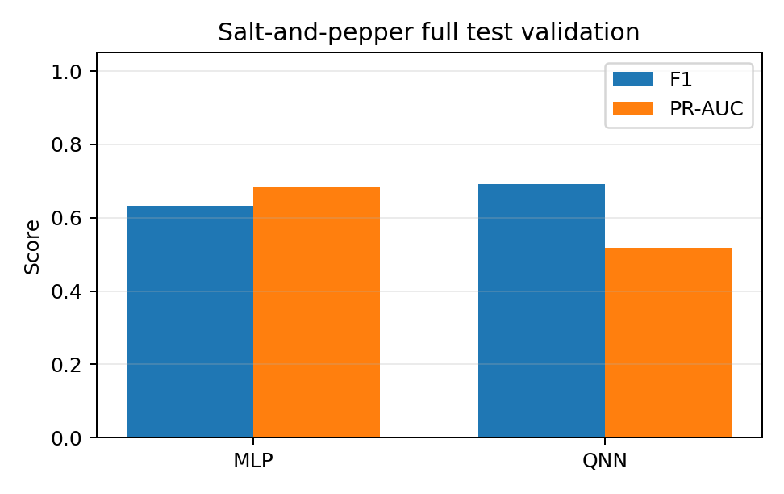

# 当前阶段结果展示汇总

更新时间：2026-06-27

## 1. 总体目标与当前状态

本项目目标是把角点/交点关键点检测任务打通为可复现实验链路：合成几何图像、采样 patch、提取结构张量特征、训练 MLP 与 QNN、评估 classical baseline，并生成 overlay 与汇报页面。

当前已经完成：

1. 合成 L-corner、T-junction、X-junction 三类几何样本。
2. patch-level 二分类数据集：keypoint / non-keypoint。
3. Harris、FAST、ORB 经典图像检测 baseline。
4. MLP baseline。
5. QNN 第一轮训练、消融实验、噪声鲁棒性实验与 demo 页面。

当前最重要的判断：

- clean 条件下 MLP 仍是最强 baseline。
- QNN 已经完成端到端接入，改进后性能明显高于第一轮 QNN，但尚不能宣称优于 MLP。
- ORB 在本任务上召回高、误检极多，因此 Precision 与 F1 很低。
- salt-and-pepper 全测试集验证显示 QNN 的固定阈值 F1 略高于 MLP，但 PR-AUC 仍低，说明排序能力还不稳定。

## 2. 评估指标解释

本项目同时报告点检测指标和 patch 分类指标。对 Harris / FAST / ORB，先把检测点与 GT keypoint 按距离容忍阈值匹配，再统计 TP / FP / FN。对 MLP / QNN，则在 patch-level 使用概率阈值 0.5 得到二分类预测。

| Metric | 含义 | 本项目中的解释 |
| --- | --- | --- |
| Precision | `TP / (TP + FP)` | 检出的点或 patch 中有多少是真的 keypoint。低 Precision 表示误检多。 |
| Recall | `TP / (TP + FN)` | GT keypoint 中有多少被找到了。低 Recall 表示漏检多。 |
| F1 | Precision 与 Recall 的调和平均 | 同时惩罚误检和漏检，适合作为当前阶段的主指标。 |
| PR-AUC | Precision-Recall 曲线下面积 | 衡量不同阈值下概率或响应分数的整体排序能力；正负样本不均衡时比 ROC-AUC 更有参考价值。 |
| ROC-AUC | TPR-FPR 曲线下面积 | 只在部分 QNN 训练日志中记录，用于辅助观察排序能力。 |
| Loss | 训练目标函数值 | MLP / QNN 训练是否收敛的过程指标，不直接等价于检测质量。 |

注意：F1 是某个阈值下的表现，PR-AUC 是跨阈值的整体排序表现。因此可能出现“F1 接近或更好，但 PR-AUC 更低”的情况。

## 3. 测试集覆盖判断

当前测试集不是只有普通 L-corner。两个数据集的 held-out test split 都按图像划分，避免同一图像的 patch 泄漏到训练和测试中。

| Dataset | Feature Dim | Test Images | Test Scene Types | Test Patches |
| --- | ---: | ---: | --- | ---: |
| `feature_dataset.npz` | 5 | 60 | L-corner 20, T-junction 20, X-junction 20 | 1500 |
| `feature_dataset_extended.npz` | 8 | 60 | L-corner 20, T-junction 20, X-junction 20 | 1500 |

需要澄清的是，当前模型任务仍是 binary keypoint detection，而不是多类别 keypoint type classification。也就是说，T-junction 和 X-junction 已经作为 keypoint 场景参与测试，但模型不输出“这是 L / T / X 哪一类”，只输出该 patch 是否包含关键点。

## 4. 6 月 26 日：经典 baseline 与早期 MLP

第一阶段完成合成数据、patch 采样、早期特征与四个 baseline 的 overlay 展示。

| Method | Precision | Recall | F1 |
| --- | ---: | ---: | ---: |
| Harris | 0.1666 | 0.9600 | 0.2839 |
| FAST | 0.0666 | 0.8733 | 0.1238 |
| ORB | 0.0296 | 1.0000 | 0.0576 |
| MLP | 0.1219 | 0.9067 | 0.2149 |


ORB 效果差的主要原因：

- ORB 本质上面向自然图像中的可重复局部纹理点，检测阶段依赖 FAST，描述阶段依赖旋转 BRIEF；而本任务是稀疏二值/灰度几何线条，纹理非常少。
- 合成线条存在大量高对比边缘、端点、抗锯齿像素和交界附近响应，ORB 容易在边缘邻域产生大量额外 keypoints。
- 当前评估只关心 GT 几何交点，ORB 检出的其他稳定边缘点都会被算作 false positive，因此 Recall 可达 1.0，但 Precision 和 F1 很低。
- ORB 的 descriptor 匹配优势在这里没有发挥，因为当前任务不是跨图匹配，而是单图关键点定位。

## 5. 6 月 27 日：统一 5 维特征接口与 QNN 第一轮

按照 QNN 计划书，统一输入特征为：

```text
[Ix, Iy, lambda1, lambda2, R]
```

MLP 与 QNN 使用同一份归一化前特征矩阵，训练阶段只在 train split 上拟合 normalizer。

| Split | Shape | Feature Dim |
| --- | ---: | ---: |
| `X_train` | `(4500, 5)` | 5 |
| `X_val` | `(1500, 5)` | 5 |
| `X_test` | `(1500, 5)` | 5 |

第一轮 clean 结果：

| Method | Input | Precision | Recall | F1 | PR-AUC |
| --- | --- | ---: | ---: | ---: | ---: |
| Harris | image | 0.1652 | 0.9500 | 0.2815 | 0.8953 |
| FAST | image | 0.0789 | 0.7833 | 0.1433 | 0.7925 |
| ORB | image | 0.0412 | 1.0000 | 0.0791 | 0.7759 |
| MLP | same 5-D features | 0.9347 | 0.9067 | 0.9205 | 0.9749 |
| QNN | same 5-D features | 0.5238 | 0.6875 | 0.5946 | 0.4672 |


阶段结论：

- 5 维接口已经满足 MLP / QNN 共用输入的要求。
- MLP 在 clean test 上表现稳定，是当前最强学习型 baseline。
- 第一轮 QNN 的链路完整，但性能不足，主要价值是证明 `features -> QNN -> probability -> loss -> metrics -> overlay` 已打通。

## 6. 提升实验：扩展特征、QNN 消融与更长训练

参考 QNN 计划书和进一步提升建议后，完成了以下实验：

- 输入从 5 维扩展到 8 维：`[Ix, Iy, Ix2, Iy2, IxIy, lambda1, lambda2, R]`。
- QNN readout 从 Z-only 扩展到 Z + neighbor ZZ。
- 对比无纠缠、线性纠缠、环形纠缠。
- 对比 1 / 2 / 3 层 QNN。
- 加入 trainable input scaling。
- 使用 small-angle initialization。
- 增加 more-data improved run。

改进主模型配置：

```text
features = 8-D
layers = 2
encoding = RyRz
entanglement = ring
readout = Z + neighbor ZZ
trainable input scaling = true
train samples = 220
test samples = 100
```

| Model | Precision | Recall | F1 | PR-AUC |
| --- | ---: | ---: | ---: | ---: |
| MLP, same 8-D features | 0.9406 | 0.9500 | 0.9453 | 0.9756 |
| Improved QNN | 0.6538 | 0.8500 | 0.7391 | 0.7909 |


消融观察：

- 改进 QNN 相比第一轮 QNN 有明显提升：F1 从 0.5946 到 0.7391，PR-AUC 从 0.4672 到 0.7909。
- 小样本消融波动较大，不能只凭单个配置断言结构优劣。
- `Z + ZZ` readout 与 trainable input scaling 对部分配置有明显帮助。
- 更深不必然更好；当前 L=3 在小子集上可达到较高 F1，但 more-data 主模型选择 L=2 更稳妥。

## 7. 噪声鲁棒性与 salt-and-pepper 放大验证

噪声实验覆盖 clean、Gaussian、blur、salt-and-pepper。第一轮鲁棒性实验为了控制 QNN 推理耗时，在 120 个 held-out patch 上评估 MLP / QNN。

| Case | MLP F1 | QNN F1 |
| --- | ---: | ---: |
| clean | 0.9167 | 0.7059 |
| gaussian_0.04 | 0.9200 | 0.7547 |
| gaussian_0.08 | 0.8364 | 0.6909 |
| blur_0.9 | 0.6667 | 0.3125 |
| saltpepper_0.03 | 0.6286 | 0.6230 |


由于 salt-and-pepper 下 MLP 与 QNN 的 F1 很接近，已补充完整 1500 个 held-out patch 的放大验证：

| Method | Samples | Positives | Precision | Recall | F1 | PR-AUC |
| --- | ---: | ---: | ---: | ---: | ---: | ---: |
| MLP | 1500 | 300 | 0.4708 | 0.9667 | 0.6332 | 0.6832 |
| QNN | 1500 | 300 | 0.5699 | 0.8833 | 0.6928 | 0.5172 |



放大验证结论：

- 在固定阈值 0.5 下，QNN 的 F1 高于 MLP，主要来自更高 Precision。
- MLP 的 PR-AUC 明显高于 QNN，说明 MLP 对正负 patch 的整体排序仍更稳。
- 这个结果值得继续放大训练样本和随机种子验证，但目前不能直接解释为 QNN 全面更鲁棒。

## 8. Demo 与当前产物

HTML 汇报页：

- `outputs/qnn_improvement_demo.html`

核心数据与指标：

- `data/feature_dataset.npz`
- `data/feature_dataset_extended.npz`
- `outputs/day2_result_table.csv`
- `outputs/improved_mlp_metrics.json`
- `outputs/improved_qnn_metrics.json`
- `outputs/qnn_ablation_results.csv`
- `outputs/noise_robustness_results.csv`
- `outputs/saltpepper_full_validation.csv`

核心展示图：

- `outputs/day2_pipeline_flow.png`
- `outputs/day2_data_samples.png`
- `outputs/day2_comparison_overlay.png`
- `outputs/day2_qnn_overlay.png`
- `outputs/qnn_ablation_results.png`
- `outputs/noise_robustness.png`
- `outputs/saltpepper_full_validation.png`
- `outputs/improved_comparison_overlay.png`

## 9. 下一步

1. 对 salt-and-pepper 结果做多随机种子验证，避免单次噪声采样误导。
2. 扩大 QNN 训练样本，优先验证 more-data 主模型是否稳定提升 PR-AUC。
3. 增加 hard negative mining，减少边缘附近 false positive。
4. 将 binary detection 扩展为 keypoint type classification，显式区分 L / T / X 等类型。
5. 整理可现场运行的交互 demo 或 notebook，把当前 HTML 汇报页中的结论与复现实验入口连接起来。
