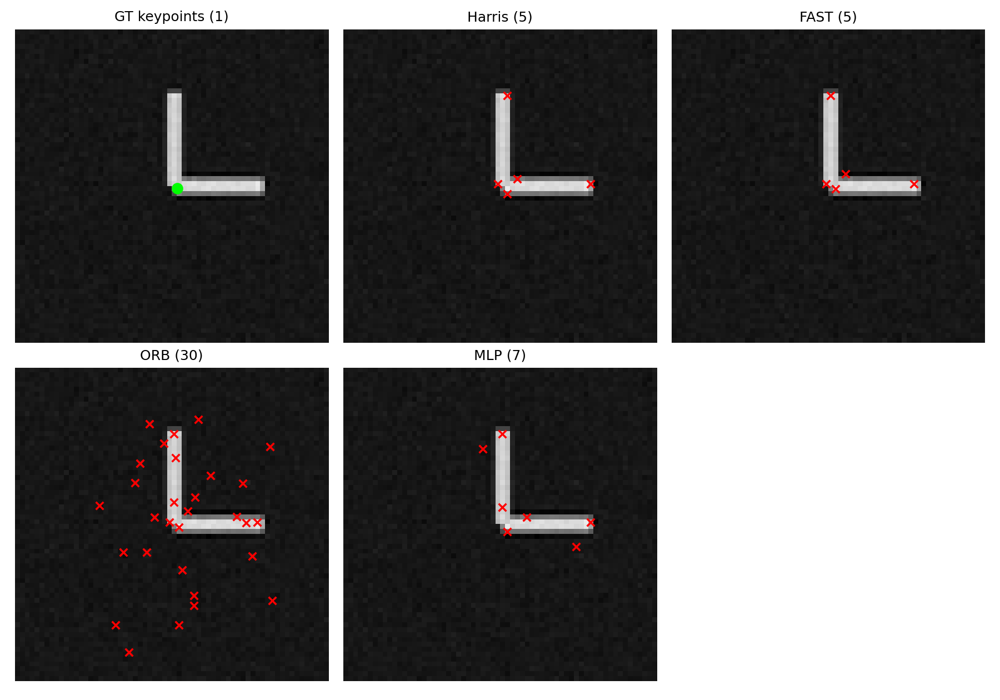
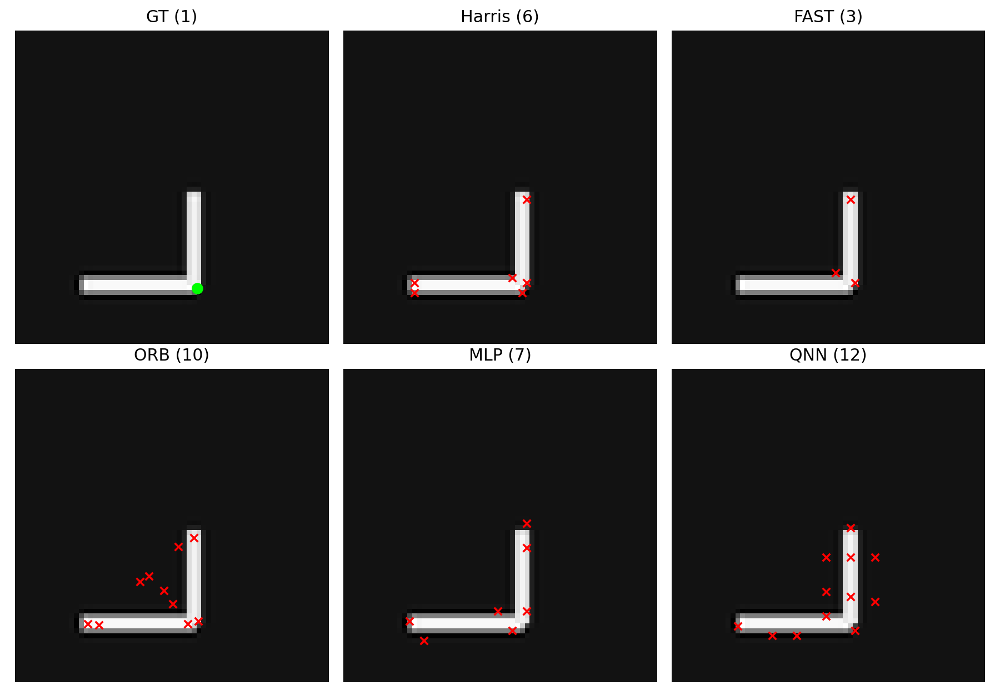
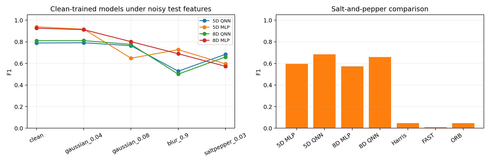
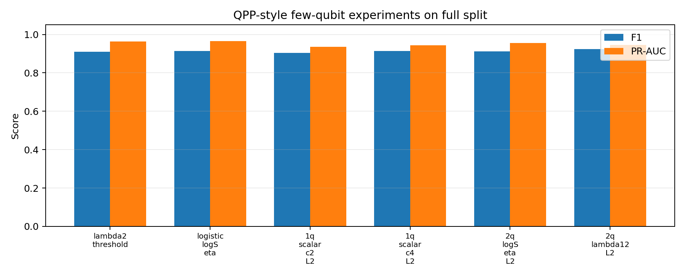
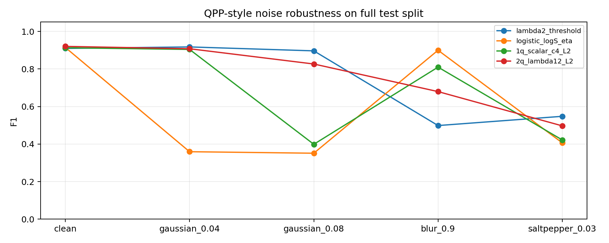
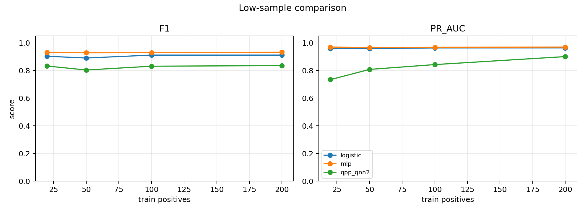
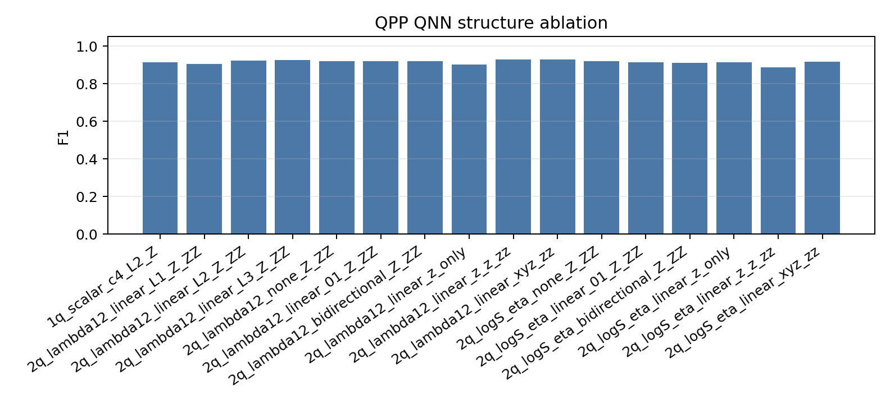
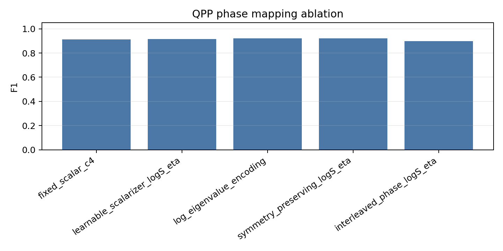
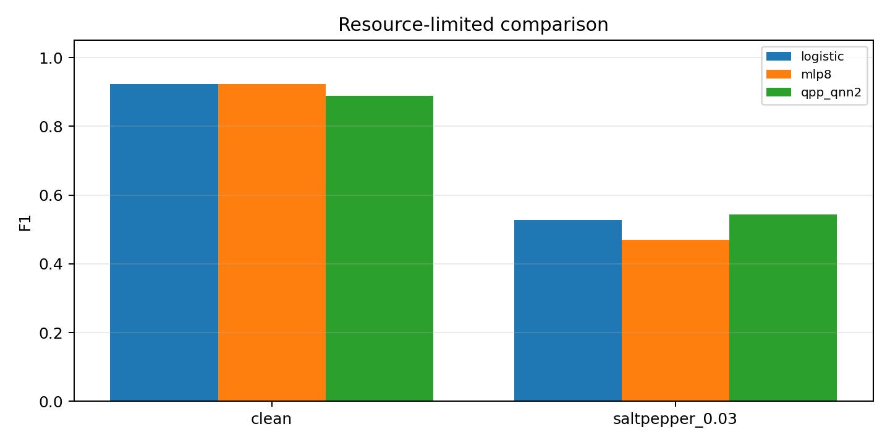

# 当前阶段结果展示汇总

更新时间：2026-06-30

## 1. 总体目标与当前主线

本项目面向 Quantum Hackathon，目标不是单纯复现经典角点检测，而是探索 **corner / junction keypoint detection 是否可以被少比特、浅层 QNN 表示**。完整流程已经打通：合成几何图像、patch 采样、结构张量特征、classical baseline、MLP、QNN 训练、噪声测试、消融实验和 demo 页面。

当前主线已经从早期的 5/8-qubit 直接特征映射，转为 **QPP-inspired few-qubit QNN**：用 1-2 qubit 和 2-3 层 data-reuploading circuit，把局部梯度结构映射为相位，通过浅层旋转、纠缠和 Z/ZZ 读出学习角点概率。

当前最重要结论：

- Classical baseline 只作为比较：Harris / FAST / ORB 误检多，MLP 是强 classical learner。
- QPP 少比特 QNN 是当前量子主线：2q `lambda12` 在 clean test 上达到 F1 0.9233，接近 5D MLP 的 0.9205。
- 1q QNN 也能有效工作：`scalar_c4` 的 1q QNN 达到 F1 0.9131，说明少比特浅层线路具备可用表达能力。
- 噪声感知训练显著改善 salt-and-pepper：QPP QNN2 F1 从 0.5448 提升到 0.7307。
- 当前还不能声称稳定量子优势：clean/low-data/resource-limited 下 MLP/logistic 多数仍更强。

### Project Title

**Few-Qubit Quantum Keypoint Detector**

Subtitle: **A NISQ-friendly QPP-inspired Geometric QNN for corner and junction detection**

### Project Summary

本项目围绕 Quantum Hackathon 的 QML keypoint detection 目标展开：用少比特 QNN 判断图像 patch 是否对应 corner / junction，并把结果放回到 SLAM、AR/VR tracking 和机器人感知这类视觉前端任务中验证。当前主线是 **NISQ-friendly few-qubit Quantum Keypoint Detector**。做法是先从 patch 中计算 structure-tensor 几何量，再把 `lambda12`、`logS_eta`、`scalar_c4` 等紧凑特征编码到 1-2 qubit 的浅层 data-reuploading QNN 中，通过 Z/ZZ readout 输出 keypoint probability。

目前已经和 Harris、FAST、ORB、logistic regression、MLP 做了 clean、Gaussian noise、salt-and-pepper、少样本、结构消融、真实图像 preview 以及合成 2D/3D motion sequence 对比。结果比较清楚：clean 条件下 classical learner 仍很强；少比特 QNN 可以接近强 baseline，并且在部分 Gaussian / salt-and-pepper 设置下表现出更慢的 fixed-threshold F1 退化。这个方向更适合被描述为资源受限、噪声场景中的 quantum-assisted visual front-end，而不是“已经全面超过经典算法”。

## 2. 指标与数据说明

| Metric | 含义 | 本项目中的解释 |
| --- | --- | --- |
| Precision | `TP / (TP + FP)` | 检出的点或 patch 中有多少是真的 keypoint；低 Precision 表示误检多。 |
| Recall | `TP / (TP + FN)` | GT keypoint 中有多少被找到了；低 Recall 表示漏检多。 |
| F1 | Precision 与 Recall 的调和平均 | 当前主指标，同时惩罚误检和漏检。 |
| PR-AUC | Precision-Recall 曲线下面积 | 衡量不同阈值下的排序能力；正负样本不均衡时尤其重要。 |
| ROC-AUC | TPR-FPR 曲线下面积 | 辅助指标，用于观察概率排序能力。 |

F1 是某个阈值下的结果，PR-AUC 是跨阈值排序能力。因此可能出现 F1 高但 PR-AUC 低的情况。

当前测试集不是只有普通 corner，而是包含 L-corner、T-junction、X-junction 三类场景。需要注意：模型当前做的是 **binary keypoint detection**，不是 L/T/X 多类别分类。

| Dataset | Feature Dim | Test Images | Test Scene Types | Test Patches |
| --- | ---: | ---: | --- | ---: |
| `feature_dataset.npz` | 5 | 60 | L 20, T 20, X 20 | 1500 |
| `feature_dataset_extended.npz` | 8 | 60 | L 20, T 20, X 20 | 1500 |

## 3. 6 月 26 日：经典 Baseline 与早期 MLP

第一阶段完成合成数据、patch 采样、经典检测器和早期 MLP。

| Method | Precision | Recall | F1 |
| --- | ---: | ---: | ---: |
| Harris | 0.1666 | 0.9600 | 0.2839 |
| FAST | 0.0666 | 0.8733 | 0.1238 |
| ORB | 0.0296 | 1.0000 | 0.0576 |
| MLP | 0.1219 | 0.9067 | 0.2149 |



ORB 效果差的原因：ORB 面向自然图像中的可重复纹理点，检测阶段依赖 FAST，描述阶段依赖旋转 BRIEF；而当前数据是稀疏几何线条，边缘、端点和抗锯齿像素会产生大量额外 keypoints。评估只把 GT 几何交点算作正例，所以 ORB 召回高但 false positive 极多，Precision 和 F1 很低。

## 4. 6 月 27 日：统一 5 维接口与第一轮 QNN

按照 QNN 计划书，统一输入为：

```text
[Ix, Iy, lambda1, lambda2, R]
```

MLP 与 QNN 使用同一份特征矩阵，normalizer 只在 train split 上拟合。

| Split | Shape | Feature Dim |
| --- | ---: | ---: |
| Train | `(4500, 5)` | 5 |
| Val | `(1500, 5)` | 5 |
| Test | `(1500, 5)` | 5 |

| Method | Input | Precision | Recall | F1 | PR-AUC |
| --- | --- | ---: | ---: | ---: | ---: |
| Harris | image | 0.1652 | 0.9500 | 0.2815 | 0.8953 |
| FAST | image | 0.0789 | 0.7833 | 0.1433 | 0.7925 |
| ORB | image | 0.0412 | 1.0000 | 0.0791 | 0.7759 |
| MLP | same 5-D features | 0.9347 | 0.9067 | 0.9205 | 0.9749 |
| QNN | same 5-D features | 0.5238 | 0.6875 | 0.5946 | 0.4672 |




结论：链路完整，但第一轮 QNN 性能不足。其价值主要是证明 `features -> QNN -> probability -> loss -> metrics -> overlay` 已经跑通。

## 5. 6 月 28 日早期：扩展特征、QNN 消融与噪声验证

在进入 QPP 主线之前，先做了 8 维特征、更多 QNN 结构和噪声鲁棒性验证：

- 输入扩展为 `[Ix, Iy, Ix2, Iy2, IxIy, lambda1, lambda2, R]`。
- QNN readout 从 Z-only 扩展到 Z + neighbor ZZ。
- 对比无纠缠、线性纠缠、环形纠缠和 1/2/3 层。
- 加入 trainable input scaling、small-angle initialization 和 more-data run。

| Model | Precision | Recall | F1 | PR-AUC |
| --- | ---: | ---: | ---: | ---: |
| MLP, same 8-D features | 0.9406 | 0.9500 | 0.9453 | 0.9756 |
| Improved QNN | 0.6538 | 0.8500 | 0.7391 | 0.7909 |


### 5.1 噪声鲁棒性与 Salt-and-Pepper 放大验证

第一轮噪声测试在 120 个 held-out patch 上评估：

| Case | MLP F1 | QNN F1 |
| --- | ---: | ---: |
| clean | 0.9167 | 0.7059 |
| gaussian_0.04 | 0.9200 | 0.7547 |
| gaussian_0.08 | 0.8364 | 0.6909 |
| blur_0.9 | 0.6667 | 0.3125 |
| saltpepper_0.03 | 0.6286 | 0.6230 |


由于 salt-and-pepper 下 MLP 与 QNN F1 接近，随后补充了完整 1500 held-out patch 验证：

| Method | Samples | Positives | Precision | Recall | F1 | PR-AUC |
| --- | ---: | ---: | ---: | ---: | ---: | ---: |
| MLP | 1500 | 300 | 0.4708 | 0.9667 | 0.6332 | 0.6832 |
| QNN | 1500 | 300 | 0.5699 | 0.8833 | 0.6928 | 0.5172 |


结论：固定阈值下 QNN F1 高于 MLP，但 PR-AUC 低于 MLP，说明 QNN 排序能力仍不稳定，不能据此直接声称全面鲁棒优势。

### 5.2 5D / 8D QNN Salt-and-Pepper 鲁棒性补充

根据 `docs/qnn_noise_robustness_report.md`，这里补充早期 5D / 8D patch-level QNN 的噪声复查，重点验证：

> 当 salt-and-pepper 噪声逐渐增强时，5D 和 8D QNN 是否比同特征 MLP 退化更慢？

实验协议更加严格：

- 训练只使用 clean train split。
- 阈值只在 clean validation split 上选择一次。
- 测试时对 held-out test images 加噪声后重新提取 patch features。
- 所有噪声强度使用同一个 clean-validation threshold，避免在噪声测试集上调参。
- 5D 与 8D 使用对齐后的 split / labels 协议。

Clean 条件下，MLP 仍然明显更强：

| Model | F1 | PR-AUC |
| --- | ---: | ---: |
| 5D MLP | 0.9386 | 0.9814 |
| 5D QNN | 0.7890 | 0.7272 |
| 8D MLP | 0.9265 | 0.9756 |
| 8D QNN | 0.8105 | 0.8289 |

但在 `saltpepper_0.03` 下，QNN 的 F1 下降更小：

| Model | Clean F1 | Salt-pepper 0.03 F1 | F1 Drop |
| --- | ---: | ---: | ---: |
| 5D MLP | 0.9386 | 0.5961 | 0.3425 |
| 5D QNN | 0.7890 | 0.6842 | 0.1048 |
| 8D MLP | 0.9265 | 0.5736 | 0.3529 |
| 8D QNN | 0.8105 | 0.6593 | 0.1512 |



Salt-and-pepper sweep 进一步显示，当噪声从 `0.00` 增加到 `0.15`：

| Model | F1 at 0.00 | F1 at 0.15 | F1 Drop |
| --- | ---: | ---: | ---: |
| 5D MLP | 0.9386 | 0.3429 | 0.5958 |
| 5D QNN | 0.7890 | 0.3503 | 0.4387 |
| 8D MLP | 0.9265 | 0.3386 | 0.5879 |
| 8D QNN | 0.8105 | 0.3911 | 0.4193 |


结论：该报告支持一个更谨慎但更有说服力的表述：**QNN 没有在 clean 或 PR-AUC 上全面超过 MLP，但在 fixed clean-threshold protocol 下，对 salt-and-pepper 这类脉冲噪声表现出更慢的 F1 退化。** 这与 QPP 主线中的噪声感知训练结果相互补充，说明 QNN 的潜在价值更集中在 resource-constrained / noisy front-end perception，而不是无噪声条件下替代所有 classical learner。

### 5.3 5D / 8D QNN 实际线路结构

早期 5D / 8D QNN 使用同一个 PennyLane `DataReuploadingQNN` 模块。它不是 QPP 少比特线路，而是 **feature-dimension-matched QNN**：输入特征有多少维，就使用多少个 qubit。

实际配置为：

| Experiment | Input Features | Qubits | Layers | Encoding | Entanglement | Readout |
| --- | --- | ---: | ---: | --- | --- | --- |
| Day2 5D QNN | `[Ix, Iy, lambda1, lambda2, R]` | 5 | 3 | `RyRz` | `ring` | all `Z` |
| Improved 8D QNN | `[Ix, Iy, Ix2, Iy2, IxIy, lambda1, lambda2, R]` | 8 | 2 | `RyRz` + trainable scale | `ring` | all `Z` + neighbor `ZZ` |

归一化和角度映射只在 train split 上拟合。对第 $$j$$ 维特征：

$$
z_j=\mathrm{clip}\left(\frac{x_j-\mu_j}{\sigma_j+\epsilon},-3,3\right),
\qquad
\phi_j=\frac{\pi}{3}z_j.
$$

如果启用 trainable input scaling，则每个 qubit 有两组可训练缩放参数 $$s^Y_j,s^Z_j$$；否则二者固定为 1。

给定 $$d$$ 维输入，线路初态为：

$$
|\psi_0\rangle=|0\rangle^{\otimes d}.
$$

第 $$\ell$$ 个 data-reuploading layer 的输入编码为：

$$
U_{\mathrm{enc}}^{(\ell)}(\phi)
=\prod_{j=0}^{d-1}
R_Z\!\left(s^Z_j\phi_j\right)
R_Y\!\left(s^Y_j\phi_j\right).
$$

注意这里每一层都会重新使用同一组 $$\phi$$，但不会重置量子态；它是在上一层量子态基础上继续作用。

每层的可训练单比特旋转为：

$$
U_{\mathrm{var}}^{(\ell)}(\theta)
=\prod_{j=0}^{d-1}
R_Z\!\left(\theta_{\ell,j,2}\right)
R_Y\!\left(\theta_{\ell,j,1}\right)
R_Z\!\left(\theta_{\ell,j,0}\right).
$$

纠缠层按实验配置选择：

$$
U_{\mathrm{ent}}^{\mathrm{none}}=I,
$$

$$
U_{\mathrm{ent}}^{\mathrm{linear}}
=\prod_{j=0}^{d-2}\mathrm{CNOT}(j,j+1),
$$

$$
U_{\mathrm{ent}}^{\mathrm{ring}}
=\prod_{j=0}^{d-1}\mathrm{CNOT}\!\left(j,(j+1)\bmod d\right).
$$

完整量子态为：

$$
|\psi_L(x)\rangle
=
\left[
\prod_{\ell=0}^{L-1}
U_{\mathrm{ent}}\,
U_{\mathrm{var}}^{(\ell)}(\theta)\,
U_{\mathrm{enc}}^{(\ell)}(\phi)
\right]
|0\rangle^{\otimes d}.
$$

5D Day2 QNN 使用 all-Z readout：

$$
r(x)=
\left[
\langle Z_0\rangle,\langle Z_1\rangle,\ldots,\langle Z_{d-1}\rangle
\right].
$$

8D improved QNN 使用 `all_zz` readout，额外加入 ring-neighbor 相关项：

$$
r(x)=
\left[
\langle Z_0\rangle,\ldots,\langle Z_{d-1}\rangle,
\langle Z_0Z_1\rangle,\ldots,\langle Z_{d-2}Z_{d-1}\rangle,
\langle Z_{d-1}Z_0\rangle
\right].
$$

最后接一个经典线性头输出 logit 和 corner probability：

$$
\mathrm{logit}(x)=w^\top r(x)+b,
\qquad
p(y=1\mid x)=\sigma(\mathrm{logit}(x)).
$$

因此，5D / 8D QNN 的本质是：**把每个结构张量特征维度分配给一个 qubit，通过 data re-uploading 和 CNOT ring 建模特征间相互作用，再用 Pauli-Z / ZZ 期望值做二分类。**

## 6. QPP-Inspired 少比特 QNN 主线

`qpp_corner_qnn_github_package` 提供了 1q/2q exact-statevector QNN、QPP 风格特征、配置化实验和 smoke tests。原包自带结果只有 smoke 级别，因此已经补跑当前项目 full split：4500 train / 1500 val / 1500 test。

### 6.1 特征定义

对每个 patch 计算 structure tensor：

$$
M(p)=\sum_{(u,v)\in W} w(u,v)
\begin{bmatrix}
I_x(u,v)^2 & I_x(u,v)I_y(u,v) \\
I_x(u,v)I_y(u,v) & I_y(u,v)^2
\end{bmatrix}.
$$

设特征值为：

$$
\lambda_1 \ge \lambda_2 \ge 0.
$$

其中 $$\lambda_2$$ 是较小特征值。边缘区域通常只有一个方向梯度强，$$\lambda_2$$ 小；角点/交点区域两个方向都强，$$\lambda_2$$ 会变大，因此它本身就是一个 classical cornerness score。

局部能量与各向同性为：

$$
S=\lambda_1+\lambda_2,
$$

$$
\eta=\frac{4\lambda_1\lambda_2}{(\lambda_1+\lambda_2)^2+\epsilon}.
$$

QPP 特征为：

$$
\mathrm{lambda12}=[\lambda_1,\lambda_2],
$$

$$
\mathrm{logS\_eta}=[\log(S+\epsilon),\eta],
$$

$$
\mathrm{scalar\_c2}=\log(S+\epsilon)+2\eta,
$$

$$
\mathrm{scalar\_c4}=\log(S+\epsilon)+4\eta.
$$

`scalar_c2` 和 `scalar_c4` 把局部能量与各向同性压成单个相位变量，适合 1q QNN；`lambda12` 和 `logS_eta` 保留二维结构，适合 2q QNN。

### 6.2 Structure Tensor 与 Entanglement Geometry

`docs/corner_entanglement_geometry.pdf` 给当前 QPP QNN 提供了一个更明确的理论解释：局部图像几何可以通过 structure tensor 映射到 two-qubit state 的纠缠分层。

核心链路为：

```text
patch -> structure tensor M(p) -> density matrix rho=M/tr(M)
      -> canonical Schmidt purification |Psi_p>
```

对应关系：

| Image Geometry | Structure Tensor | Quantum State Interpretation |
| --- | --- | --- |
| Flat / no signal | `M = 0` | vacuum / low-energy sector |
| Smooth edge | `rank M = 1` | product / separable two-qubit state |
| Corner / junction | `rank M = 2` | entangled two-qubit state |

严格公式包括：

$$
\mathrm{SchmidtRank}(|\Psi_M\rangle)=\mathrm{rank}(M),
$$

$$
\eta=\frac{4\lambda_1\lambda_2}{(\lambda_1+\lambda_2)^2}=C^2,
$$

$$
R=S^2\left(\frac{C^2}{4}-k\right),
$$

其中 $$C$$ 是 two-qubit pure state concurrence，$$S=\lambda_1+\lambda_2$$ 是局部梯度能量，$$R$$ 是 Harris response。也就是说，Harris cornerness 可以解释为：

```text
local gradient energy × penalty-corrected entanglement strength
```

该文档还说明了几何变换与量子变换之间的关系：

- 图像旋转 / 反射使 `M -> Q M Q^T`，对应 quantum local unitary，因此 `eta` / `C^2` 保持不变。
- affine stretch 对应 local filtering / SLOCC-like transformation，可保持 rank 分层但改变纠缠强度。
- 奇异 stretch 可能导致 rank collapse，对应 entangled -> product -> vacuum 的退化层级。

需要区分当前已实现与下一步理论化版本：

- 当前已实现 QPP QNN：把 `lambda12`、`logS_eta` 或 `scalar_c4` 作为 angle / phase features 输入 1q/2q data-reuploading QNN。
- 理论文档建议的下一步：显式加入 **Schmidt preparation layer**，用 `Ry(2theta)+CNOT` 制备

$$
|\Psi_p\rangle=\sqrt{\mu_1}|00\rangle+\sqrt{\mu_2}|11\rangle,
$$

其中

$$
\mu_i=\frac{\lambda_i}{\lambda_1+\lambda_2},\quad \eta=C^2.
$$

这样可以把“角点是 high-energy entangled strata”的叙述从特征解释升级为线路结构本身。

### 6.3 QNN 模型结构与线路图


当前实现的 2q QPP QNN 可以概括为：

```text
normalized geometric features
-> Ry/Rz data encoding and re-uploading
-> trainable Rz-Ry-Rz local rotations
-> optional CNOT entanglement
-> Z / Z+ZZ / X,Y,Z+ZZ readout
-> affine head
-> corner probability
```

以当前常用的 **2bit / 2-layer QPP QNN** 为例，输入不再是 5D/8D 全特征，而是：

$$
x=[\lambda_1,\lambda_2].
$$

先使用 train-only normalizer 和 angle map：

$$
z_i=\mathrm{clip}\left(\frac{x_i-\mu_i}{\sigma_i+\epsilon},-3,3\right),
\qquad
\phi_i=\frac{\pi}{3}z_i,\quad i\in\{0,1\}.
$$

其中 $$\phi_0$$ 对应 $$\lambda_1$$，$$\phi_1$$ 对应 $$\lambda_2$$。线路初态为：

$$
|\psi_0\rangle=|00\rangle.
$$

对第 $$\ell$$ 层，代码中的门顺序是：

```text
for q in {0, 1}:
    RY_q(phi_q)
    RZ_q(phi_q)

for q in {0, 1}:
    RZ_q(theta[l,q,0])
    RY_q(theta[l,q,1])
    RZ_q(theta[l,q,2])

CNOT(0 -> 1)
```

如果写成算符乘积，即右侧先作用，则每层可以记为：

$$
U_{\mathrm{enc}}(\phi)
=
\prod_{q=0}^{1}
R_Z^{(q)}(\phi_q)R_Y^{(q)}(\phi_q),
$$

$$
U_{\mathrm{var}}^{(\ell)}(\theta)
=
\prod_{q=0}^{1}
R_Z^{(q)}(\theta_{\ell,q,2})
R_Y^{(q)}(\theta_{\ell,q,1})
R_Z^{(q)}(\theta_{\ell,q,0}),
$$

$$
U_{\mathrm{ent}}=\mathrm{CNOT}(0,1).
$$

因此 2-layer QPP QNN 的完整量子态是：

$$
|\psi_2(x)\rangle
=
\left[
U_{\mathrm{ent}}U_{\mathrm{var}}^{(1)}U_{\mathrm{enc}}
\right]
\left[
U_{\mathrm{ent}}U_{\mathrm{var}}^{(0)}U_{\mathrm{enc}}
\right]
|00\rangle.
$$

读出使用三个 Pauli expectation：

$$
r(x)=
\left[
\langle Z_0\rangle,
\langle Z_1\rangle,
\langle Z_0Z_1\rangle
\right]_{\psi_2(x)}.
$$

最后的 classical affine head 为：

$$
\mathrm{logit}(x)=
\alpha_0\langle Z_0\rangle
+\alpha_1\langle Z_1\rangle
+\alpha_2\langle Z_0Z_1\rangle
+\beta,
$$

$$
p(y=1\mid x)=\sigma(\mathrm{logit}(x)).
$$

对应的纯文本线路可以写成：

```text
q0: |0> -- Ry(phi0) -- Rz(phi0) -- Rz(t000) -- Ry(t001) -- Rz(t002) --●--
                                                                              |
q1: |0> -- Ry(phi1) -- Rz(phi1) -- Rz(t010) -- Ry(t011) -- Rz(t012) --X--

q0:      -- Ry(phi0) -- Rz(phi0) -- Rz(t100) -- Ry(t101) -- Rz(t102) --●-- measure Z0
                                                                              |
q1:      -- Ry(phi1) -- Rz(phi1) -- Rz(t110) -- Ry(t111) -- Rz(t112) --X-- measure Z1

classical readout: [<Z0>, <Z1>, <Z0Z1>] -> linear head -> sigmoid probability
```

这与 5D/8D QNN 的区别很直接：5D/8D 让每个原始特征维度对应一个 qubit；QPP QNN 先把几何结构压缩成 1-2 个 QPP 特征，再用很少的 qubits 和浅层线路学习几何 cue 的非线性组合。

纠缠模式含义：

| Entanglement | Circuit Meaning |
| --- | --- |
| `none` | 不加入 CNOT，两个 qubits 只通过 readout 和 shared loss 间接共同学习。 |
| `linear_01` / `linear` | 加入 `CNOT(q0 -> q1)`，让第 0 个 qubit 的状态影响第 1 个 qubit。 |
| `bidirectional` | 先 `CNOT(q0 -> q1)`，再 `CNOT(q1 -> q0)`，形成双向耦合。 |

### 6.4 Threshold 与 Logistic 含义

Threshold 是一个非常简单的 classical baseline，但更准确地说它是 **single-score reference detector**，不是 Harris/FAST/ORB 那类完整图像关键点算法。这里使用：

$$
s(p)=\lambda_2(p),
$$

在 validation set 上选择最大化 F1 的阈值 $$\tau$$，测试时：

$$
\hat{y}(p)=\mathbf{1}[s(p)\ge \tau].
$$

Logistic 是同特征 classical classifier。对 `logS_eta` 或 `lambda12` 做 train-only normalization 后学习：

$$
P(y=1\mid x)=\sigma(w^\top x+b).
$$

它用于判断 QPP QNN 是否比同特征的简单 classical learner 更有价值。

### 6.5 Clean Full Split

| Method | Features | Qubits | Layers | Precision | Recall | F1 | PR-AUC |
| --- | --- | ---: | ---: | ---: | ---: | ---: | ---: |
| Threshold | lambda2 | 0 | 0 | 0.9128 | 0.9067 | 0.9097 | 0.9635 |
| Logistic | logS_eta | 0 | 0 | 0.8683 | 0.9667 | 0.9148 | 0.9664 |
| QPP QNN1 | scalar_c2 | 1 | 2 | 0.8850 | 0.9233 | 0.9038 | 0.9357 |
| QPP QNN1 | scalar_c4 | 1 | 2 | 0.8679 | 0.9633 | 0.9131 | 0.9437 |
| QPP QNN2 | logS_eta | 2 | 2 | 0.8675 | 0.9600 | 0.9114 | 0.9562 |
| QPP QNN2 | lambda12 | 2 | 2 | 0.8865 | 0.9633 | 0.9233 | 0.9448 |



解释：2q `lambda12` QPP QNN 的 F1 已经接近甚至略高于 5D MLP，但 PR-AUC 仍低于 MLP/logistic，说明固定阈值性能强，整体排序能力仍需提升。

## 7. QPP 噪声、少样本与消融补充实验

### 7.1 Clean-Train 噪声鲁棒性

训练使用 clean train split，阈值在 clean validation split 上选择，测试时对 held-out test images 加噪声后重新提取特征。

| Case | Threshold F1 | Logistic F1 | QPP QNN1 F1 | QPP QNN2 F1 |
| --- | ---: | ---: | ---: | ---: |
| clean | 0.9097 | 0.9148 | 0.9131 | 0.9204 |
| gaussian_0.04 | 0.9176 | 0.3594 | 0.9043 | 0.9080 |
| gaussian_0.08 | 0.8967 | 0.3514 | 0.3989 | 0.8266 |
| blur_0.9 | 0.4988 | 0.9000 | 0.8100 | 0.6797 |
| saltpepper_0.03 | 0.5480 | 0.4065 | 0.4220 | 0.4970 |



### 7.2 噪声感知训练

在 train split 加入 Gaussian、blur、salt-and-pepper augmentation 后，测试 salt-and-pepper。

| Setting | Train Samples | Precision | Recall | F1 | PR-AUC |
| --- | ---: | ---: | ---: | ---: | ---: |
| Clean train | 4500 | 0.3768 | 0.9833 | 0.5448 | 0.4857 |
| Noise-aware train | 22500 | 0.6407 | 0.8500 | 0.7307 | 0.7712 |


这是当前最明确的 QPP 提升结果：噪声感知训练显著恢复 salt-and-pepper 下的 F1 和 PR-AUC。

### 7.3 少样本实验

比较 20/50/100/200 train positives 下的 QPP QNN、logistic、MLP。每组使用 1:4 正负样本，测试仍为 full test split。

| Train Positives | Logistic F1 / PR-AUC | MLP F1 / PR-AUC | QPP QNN F1 / PR-AUC |
| ---: | ---: | ---: | ---: |
| 20 | 0.9031 / 0.9589 | 0.9305 / 0.9700 | 0.8324 / 0.7341 |
| 50 | 0.8904 / 0.9587 | 0.9281 / 0.9653 | 0.8037 / 0.8080 |
| 100 | 0.9115 / 0.9635 | 0.9290 / 0.9680 | 0.8311 / 0.8429 |
| 200 | 0.9115 / 0.9638 | 0.9320 / 0.9696 | 0.8356 / 0.9006 |



结论：当前 low-data 设置没有放大 QPP 优势，MLP/logistic 更强。QPP 的 PR-AUC 随样本量增加明显上升，说明训练样本仍是关键限制。

### 7.4 量子结构消融

| Experiment | Best F1 | Observation |
| --- | ---: | --- |
| 1q scalarizer | 0.9131 | 单比特浅层线路已经可用。 |
| 2q lambda12, 1/2/3 layers | 0.9269 | L=3 F1 略高，L=2 PR-AUC/稳定性较好。 |
| Entanglement none / linear / bidirectional | 0.9211-0.9205 | 纠缠方式差异不大，说明当前特征本身已很强。 |
| Readout Z-only / Z+ZZ / X,Y,Z+ZZ | 0.9279 | richer readout 提高 PR-AUC，X/Y/Z+ZZ 最好。 |



### 7.5 相位映射实验

| Phase Mapping | F1 | PR-AUC |
| --- | ---: | ---: |
| fixed scalarizer | 0.9131 | 0.9681 |
| learnable scalarizer | 0.9163 | 0.9468 |
| log-eigenvalue encoding | 0.9219 | 0.9658 |
| symmetry-preserving logS_eta | 0.9203 | 0.9588 |
| interleaved phase encoding | 0.8971 | 0.9177 |



结论：log-eigenvalue 和 symmetry-preserving encoding 表现稳定；当前 interleaved phase 版本未带来提升，后续需要更明确地把 junction 对称性写进编码。

### 7.6 资源受限验证

固定 100 train positives、二维输入、QPP 使用 2 qubits / 2 layers，并把 QPP score 离散到 1024-shot resolution；MLP 使用一个 8-unit hidden layer。

| Condition | Logistic F1 / PR-AUC | MLP F1 / PR-AUC | QPP QNN F1 / PR-AUC |
| --- | ---: | ---: | ---: |
| clean | 0.9231 / 0.9645 | 0.9233 / 0.9698 | 0.8892 / 0.8864 |
| saltpepper_0.03 | 0.5276 / 0.7668 | 0.4699 / 0.7352 | 0.5434 / 0.3289 |



结论：clean 资源受限下 QPP 未超过 classical；salt-and-pepper 固定阈值 F1 略高于 MLP/logistic，但 PR-AUC 很低，说明还不是稳定优势。

## 8. 最终 Clean-Test 对比

| Method | Input | Precision | Recall | F1 | PR-AUC |
| --- | --- | ---: | ---: | ---: | ---: |
| Harris | image | 0.1652 | 0.9500 | 0.2815 | 0.8953 |
| FAST | image | 0.0789 | 0.7833 | 0.1433 | 0.7925 |
| ORB | image | 0.0412 | 1.0000 | 0.0791 | 0.7759 |
| MLP | same 5-D features | 0.9347 | 0.9067 | 0.9205 | 0.9749 |
| Early QNN | same 5-D features | 0.5238 | 0.6875 | 0.5946 | 0.4672 |
| Threshold | lambda2 | 0.9128 | 0.9067 | 0.9097 | 0.9635 |
| Logistic | logS_eta | 0.8683 | 0.9667 | 0.9148 | 0.9664 |
| QPP QNN1 | scalar_c4 | 0.8679 | 0.9633 | 0.9131 | 0.9437 |
| QPP QNN2 | lambda12 | 0.8865 | 0.9633 | 0.9233 | 0.9448 |


## 9. 当前产物

### 9.1 Demo 视频

已制作演示材料：

| Demo | Source | 内容 | 输出 |
| --- | --- | --- | --- |
| Real-data preview | HPatches example sequence | Harris / FAST / ORB / QPP QNN overlay，6 帧 | `outputs/demos/realdata/videos/realdata_hpatches_qpp_overlay.mp4` / `.gif` |
| Real-data preview | KITTI drive 0001 | 2x2 上下排布：Logistic / Harris / FAST / 2-qubit QNN，72 帧，2 fps，约 36 秒；各算法检测点统一红色标注 | `outputs/demos/realdata/videos/realdata_kitti_qpp_overlay.mp4` / `.gif` |
| Dynamic noise robustness | synthetic held-out test image | 同一图像从 clean 逐渐加入 Gaussian noise，Logistic / FAST / 1-qubit QNN / 2-qubit QNN 对比，GT 以绿色圆圈叠加 | `outputs/demos/dynamic_noise/videos/dynamic_noise_robustness_demo.mp4` / `.gif` |
| Real dataset samples | Oxford VGG / EuRoC MAV / TUM RGB-D | 下载小批真实数据样例并生成拼图，用于说明真实图像大致外观 | `outputs/demos/realdata/samples/real_dataset_samples.png` |
| Synthetic motion benchmark | generated 2D / 3D geometry | 2D 几何体旋转/平移/缩放与 3D 线框 cube/pyramid 投影运动，评估 Harris / FAST / ORB / Logistic / QPP QNN2 | `outputs/motion/benchmark/synthetic_motion_2d_comparison.mp4` / `outputs/motion/benchmark/synthetic_motion_3d_comparison.mp4` |

真实数据 preview 暂无 GT 标注，因此只报告 keypoint count 和 QPP score summary，不报告 Precision / Recall / F1。视频已改为 H.264/yuv420p 编码，并提供 GIF 备份，避免播放器出现绿屏。动态噪声视频固定同一张合成测试图，使用固定 Gaussian noise field 逐步增加强度，避免内容跳变。

核心脚本：

- 固定 5 维输入接口与首轮训练管线
- `qiskit/qpp_qnn_qiskit.py`
- `scripts/run_improvement_experiments.py`
- `scripts/run_qpp_few_qubit_experiments.py`
- `scripts/run_qpp_noise_robustness.py`
- `scripts/run_qpp_next_step_experiments.py`
- `scripts/build_realdata_and_noise_demos.py`
- `scripts/download_real_dataset_previews.py`
- `scripts/generate_qnn_structure_diagrams.py`

核心输出：

- `outputs/summaries/final_comparison_results.csv`
- `outputs/qpp/few_qubit/qpp_few_qubit_results.csv`
- `outputs/qpp/noise/qpp_noise_robustness_results.csv`
- `outputs/qpp/noise_aware/qpp_noise_aware_results.csv`
- `outputs/qpp/low_sample/qpp_low_sample_results.csv`
- `outputs/qpp/structure_ablation/qpp_structure_ablation_results.csv`
- `outputs/qpp/phase_mapping/qpp_phase_mapping_results.csv`
- `outputs/qpp/resource_advantage/qpp_resource_advantage_results.csv`
- `outputs/qpp/diagrams/qpp_qnn_model_structure.png`
- `outputs/qpp/diagrams/qpp_qnn_circuit_diagram.png`
- `outputs/demos/realdata/reports/realdata_preview_report.md`
- `outputs/demos/realdata/samples/real_dataset_samples.png`
- `outputs/demos/realdata/reports/real_dataset_samples_report.md`
- `outputs/demos/realdata/videos/realdata_hpatches_qpp_overlay.mp4`
- `outputs/demos/realdata/videos/realdata_kitti_qpp_overlay.mp4`
- `outputs/demos/dynamic_noise/videos/dynamic_noise_robustness_demo.mp4`
- `outputs/motion/benchmark/synthetic_motion_metrics.csv`
- `outputs/motion/benchmark/synthetic_motion_2d_comparison.mp4`
- `outputs/motion/benchmark/synthetic_motion_3d_comparison.mp4`
- `outputs/qnn_improvement/demo/qnn_improvement_demo.html`

### 9.2 合成 2D / 3D 连续运动数据集

已新增合成运动 benchmark：生成连续 2D 平面几何体运动和 3D 线框几何体投影运动，并用几何顶点/交点作为 GT keypoints。

| Sequence | Method | Precision | Recall | F1 |
| --- | --- | ---: | ---: | ---: |
| 2D motion | Harris | 0.3346 | 0.9778 | 0.4986 |
| 2D motion | FAST | 0.3005 | 0.9417 | 0.4556 |
| 2D motion | ORB | 0.2887 | 0.8333 | 0.4289 |
| 2D motion | Logistic | 0.1475 | 0.9833 | 0.2565 |
| 2D motion | QPP QNN2 | 0.1467 | 0.9778 | 0.2551 |
| 3D motion | FAST | 0.2573 | 0.9207 | 0.4022 |
| 3D motion | Harris | 0.2467 | 0.7253 | 0.3682 |
| 3D motion | Logistic | 0.1821 | 0.8453 | 0.2996 |
| 3D motion | QPP QNN2 | 0.1750 | 0.8124 | 0.2880 |
| 3D motion | ORB | 0.1777 | 0.3946 | 0.2450 |

观察：当前 QPP QNN2 在新合成运动分布上仍能覆盖大量真实几何顶点，Recall 较高；但直接沿用 patch 分类阈值做整图滑窗会产生大量重复/邻近误检，平均每帧达到 `max_points=60`，Precision 和 F1 被明显压低。下一步应加入运动序列专用的自适应阈值、NMS 半径调参、temporal tracking，以及用这类 2D/3D motion 数据对 QPP QNN 做 fine-tuning 或 domain-randomized training。

### 9.3 Motion Domain Fine-Tuning、Adaptive Threshold 与 Stronger NMS

已完成 motion-domain adaptation 实验：

- 按每个序列前 70% / 中间 15% / 后 15% 划分 train / validation / test frame，避免直接在测试帧上调参。
- 从 motion frame 中采样 GT 附近 positive patch、随机 background negative patch，以及原始 QPP QNN 的 hard false-positive negative patch。
- 加入 brightness / contrast jitter、Gaussian noise、mild blur、少量 salt-and-pepper，形成 domain-randomized fine-tuning 数据。
- 对学习型检测器使用 validation frame 调 per-frame score quantile threshold、NMS radius 和 max points。
- 对 Harris / FAST / ORB 同样在 validation frame 上调阈值、NMS radius 和 max points。

Test split 结果：

| Sequence | Method | Precision | Recall | F1 | Mean Detected |
| --- | --- | ---: | ---: | ---: | ---: |
| 2D motion | QPP QNN2 original + adaptive/NMS | 0.3333 | 0.8889 | 0.4848 | 24.0 |
| 2D motion | QPP QNN2 fine-tuned + adaptive/NMS | 0.4167 | 0.6481 | 0.5072 | 14.0 |
| 2D motion | Harris tuned | 0.3571 | 0.7407 | 0.4819 | 18.7 |
| 2D motion | FAST tuned | 0.3247 | 0.9259 | 0.4808 | 25.7 |
| 3D motion | QPP QNN2 original + adaptive/NMS | 0.3125 | 0.5769 | 0.4054 | 24.0 |
| 3D motion | QPP QNN2 fine-tuned + adaptive/NMS | 0.4405 | 0.4744 | 0.4568 | 14.0 |
| 3D motion | FAST tuned | 0.3443 | 0.9359 | 0.5034 | 35.3 |
| 3D motion | Harris tuned | 0.3566 | 0.5897 | 0.4444 | 21.5 |

结论：adaptive threshold + stronger NMS 已经显著减少 QPP QNN2 的重复检测；motion/domain-randomized fine-tuning 进一步提高 Precision 和 F1。当前 fine-tuned QNN 在 2D motion 上达到最高 F1，在 3D motion 上仍略低于 FAST，但明显优于原始 QNN。下一步更适合继续做 temporal tracking / recurrent smoothing，让 QNN 的检测点在连续帧之间保持一致。

## 10. Hackathon Narrative Summary

### Problem + Solution

Problem: visual SLAM、AR/VR tracking 和 robotics perception 都依赖稳定的 salient keypoints，例如 corners 和 junctions。传统 Harris / FAST / ORB 很快，但在噪声、低纹理、几何线框和动态场景中容易产生大量误检；较强的 classical learning baseline 如 MLP 又可能对噪声分布和资源预算更敏感。

Solution: 本项目提出 **Few-Qubit Quantum Keypoint Detector**：用 structure tensor 提取局部几何信息，把角点/交点检测转化为少比特 QNN 的 corner probability 预测，并配合 adaptive threshold、NMS、noise-aware training 和 motion-domain fine-tuning 形成完整检测 pipeline。

### Quantum Approach: Algorithm or Protocol

当前主线是 **QPP-inspired Geometric QNN**：

1. 对每个 patch 计算 structure tensor `M(p)`。
2. 提取 `lambda12`、`logS_eta`、`scalar_c2/c4` 等 compact geometric quantum features。
3. 将特征归一化后映射为 QNN rotation angles / phases。
4. 使用 1q 或 2q data-reuploading circuit：
   - 1q：处理 `logS + c eta` 这样的 scalar phase。
   - 2q：处理 `[lambda1, lambda2]` 或 `[logS, eta]`。
5. 使用 trainable `Rz-Ry-Rz` local rotations、可选 CNOT entanglement、Z/ZZ readout 和 affine head 输出 corner probability。
6. 在图像级别通过 adaptive threshold 和 NMS 输出 keypoints。

理论解释来自 `corner_entanglement_geometry.pdf`：structure tensor 的 rank 分层可对应 two-qubit Schmidt purification 的纠缠分层，且

$$
\eta=C^2,\qquad R=S^2\left(\frac{C^2}{4}-k\right).
$$

因此项目的量子叙事不是“把任意特征塞进 QNN”，而是：**把 corner / junction 的二维几何结构解释为 high-energy entangled strata，并用少比特 QNN 学习该结构的判别边界。**

### Implementation & Tools

当前实现仍以 simulator-first 为主，但已经把 clean-test F1 最好的一版 QPP QNN forward circuit 迁移到 Qiskit，便于后续做 finite-shot 和真实 backend 验证：

- Python / NumPy：数据生成、patch 采样、特征计算。
- OpenCV：Harris、FAST、ORB、图像处理和视频帧处理。
- PyTorch：MLP、logistic wrapper、exact-statevector QNN training。
- PennyLane / QNN planning code：早期 QNN 框架与计划书参考。
- Qiskit：当前 clean-test F1 最好的 `qpp_2q_lambda12_linear_L3_Z_ZZ` 线路的 inference port，可 transpile 到真实 NISQ backend。
- Matplotlib / Pillow / ffmpeg：overlay、曲线、结构图、演示视频。
- 当前训练仍使用 PyTorch exact differentiable statevector，便于快速调参和消融；Qiskit 版本保留同一组 L=3 权重和线路结构，用于线路展示、finite-shot inference 和真实硬件试跑。此前 demo / 噪声脚本多沿用 L=2 checkpoint，是稳定性和脚本复用口径，不代表按 F1 选出的最佳模型。

### QC Advantage + Challenges & Mitigations

目前能比较稳妥表述的量子侧价值：

- **NISQ-friendly resource profile**：1-2 qubits、浅层 data-reuploading circuit、低参数量。
- **Noise robustness signal**：在 fixed clean-threshold protocol 下，5D/8D QNN 对 salt-and-pepper 噪声的 F1 退化小于同特征 MLP；QPP 噪声感知训练也显著提升 salt-and-pepper F1 和 PR-AUC。
- **Geometry-aligned quantum structure**：structure tensor 的二维性 `eta` 可解释为 two-qubit concurrence square `C^2`，为 QNN 结构提供量子信息学设计理由。
- **Resource-constrained front-end relevance**：少比特模型可作为 quantum edge AI / hybrid perception front-end 的候选组件。

当前限制：

- Clean 条件下 MLP / logistic 仍然很强，QNN 不能被表述为全面胜出。
- 部分实验中 QNN F1 较高但 PR-AUC 较低，说明排序能力还不稳定。
- 当前普通 angle-encoding 2q QNN 尚未显式实现 Schmidt preparation layer，因此“纠缠分层”目前主要是理论解释和下一步结构设计方向。
- 图像级滑窗会产生重复检测，需要 adaptive threshold、stronger NMS 和 temporal tracking 缓解。

已经做过的缓解：

- noise-aware training；
- low-sample、resource-limited、phase mapping、structure ablation；
- motion/domain-randomized fine-tuning；
- adaptive threshold 与 stronger NMS；
- 真实图像 preview 和合成 2D/3D motion benchmark。

### Impact

本项目的直接影响是为 quantum computer vision 提供一个清晰、可运行、可解释的前端任务：salient keypoint detection。相比分类玩具任务，corner / junction detection 更贴近 visual SLAM、AR/VR、robotics 和 embedded perception，对噪声、运动和资源约束都有实际意义。

### Problem Impact & Importance

关键点检测是许多视觉系统的前端瓶颈：

- SLAM 需要稳定角点进行定位和地图构建。
- AR/VR 需要低延迟 tracking。
- Robotics 需要在噪声、低光和运动情况下保持感知稳定。
- Edge devices 受限于功耗、模型大小、延迟和传感器噪声。

因此，一个少比特、浅层、噪声感知的 QML keypoint detector 可以成为 quantum-assisted perception 的合理切入点。

### Business Sustainability & Scalability

Hackathon 之后的可延展性：

- 短期可作为 research demo / SDK component：输入图像或视频，输出 quantum-assisted keypoint overlay 和指标。
- 中期可作为 hybrid feature front-end：与 classical SLAM / VIO / AR tracking pipeline 结合，只替换或增强 keypoint scoring。
- 长期可迁移到 quantum cloud 或 quantum edge AI setting：由于模型只需 1-2 qubits 和浅层线路，资源需求相对可控。

可能的持续推进方式：

- 可围绕 noisy / low-power / resource-constrained perception 建立 benchmark service、demo API 或 embedded prototype。
- 可扩展到 junction type classification、descriptor learning、temporal tracking 和 multi-sensor VIO。
- 目前商业化仍依赖量子硬件延迟、shots 成本、I/O overhead 和稳定量子优势验证；因此近期定位更适合 quantum-enhanced research prototype，而不是立即替代 classical detector 的产品。

## 11. Next Steps

1. 多随机种子重复 QPP 实验，报告均值和方差。
2. 把 binary detection 扩展为 L / T / X keypoint type classification。
3. 重新设计 junction-aware 相位编码，把对称性、交叉方向和多方向梯度更直接地映射到量子叠加与纠缠结构。
4. 做更严格的 hardware-aware / finite-shot 实验：不同 shots、读出噪声、线路深度和参数量约束。
5. 在真实图像或更复杂合成场景上验证 QPP QNN 是否仍能保持少比特优势。
6. 实现 `corner_entanglement_geometry.pdf` 建议的 explicit Schmidt-preparation 2q QNN，并验证 `<X0X1>^2 = eta`。
7. 在当前 Qiskit forward port 基础上，补 finite-shot 批量评估、readout-error mitigation 和真实 backend 小规模测试。
8. 将 motion-domain fine-tuning 与 temporal tracking / recurrent smoothing 结合，提高动态场景下的稳定性。
