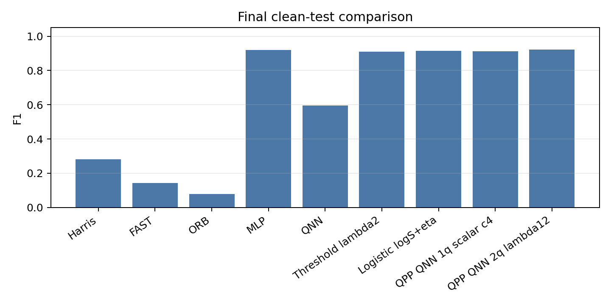
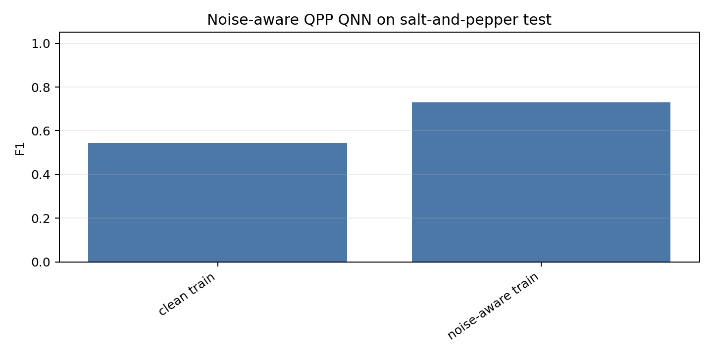
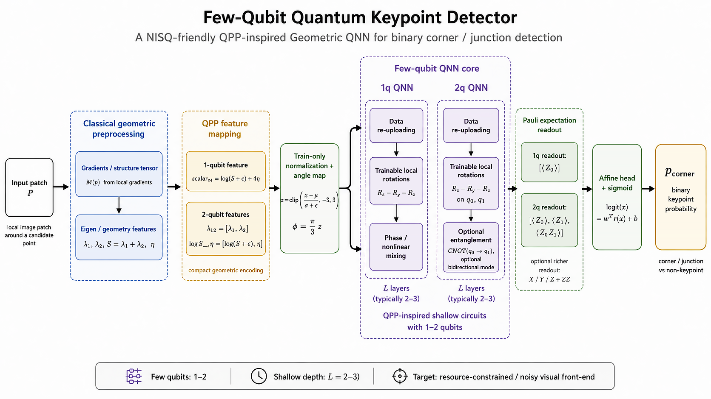
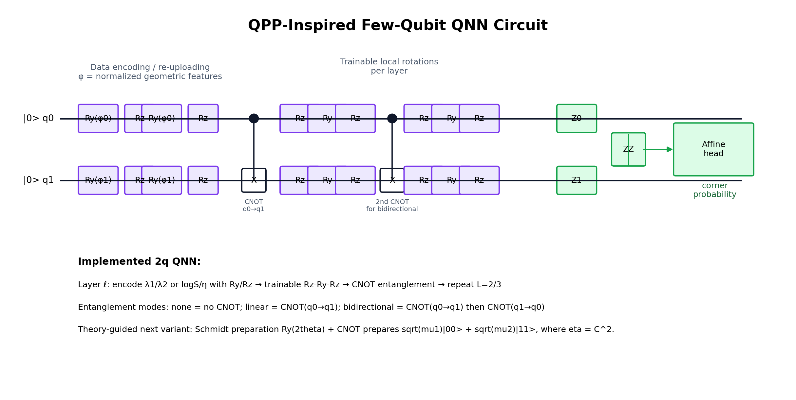

# Current Results Summary

Updated: 2026-07-01

## 1. Project Focus

**Project Title:** Few-Qubit Quantum Keypoint Detector  
**Subtitle:** A NISQ-friendly QPP-inspired geometric QNN for corner and junction detection

This project explores whether salient image keypoints, especially corners and junctions, can be represented and detected by shallow few-qubit quantum neural networks. The target applications are visual SLAM, AR/VR tracking, robotics perception, and resource-constrained visual front-ends.

The current main line has moved from early 5D/8D feature-dimension-matched QNNs to a **QPP-inspired few-qubit QNN**:

```text
image / patch
-> structure tensor
-> compact geometric features: lambda12, logS_eta, scalar_c4
-> 1-2 qubit data-reuploading QNN
-> Z / ZZ readout
-> keypoint probability
-> threshold + NMS + overlay
```

Classical methods are used as baselines, not as the main contribution. The quantum focus is the compact QPP feature representation, shallow data-reuploading circuits, and noise/resource-aware behavior.

## 2. Main Takeaways

- Harris / FAST / ORB are fast classical baselines but produce many false positives on sparse geometric line drawings.
- MLP and logistic regression remain strong classical learning baselines on clean patch data.
- The current QPP few-qubit QNN is the quantum main line. The 2-qubit `lambda12` model reaches **F1 0.9233** on the clean test split, close to the 5D MLP F1 of **0.9205**.
- A 1-qubit `scalar_c4` QNN also works well, reaching **F1 0.9131**, showing that a very small shallow circuit can model useful corner structure.
- Noise-aware QPP training improves salt-and-pepper robustness: QPP QNN2 F1 rises from **0.5448** to **0.7307** on the salt-and-pepper test.
- The project does **not** claim stable overall quantum advantage yet. Clean and low-data settings still often favor MLP/logistic baselines.

## 3. Metrics

| Metric | Meaning | Project Use |
| --- | --- | --- |
| Precision | `TP / (TP + FP)` | How many detected points are true keypoints. |
| Recall | `TP / (TP + FN)` | How many ground-truth keypoints are found. |
| F1 | Harmonic mean of precision and recall | Main fixed-threshold metric. |
| PR-AUC | Area under the precision-recall curve | Measures ranking quality across thresholds. |
| ROC-AUC | Area under the ROC curve | Secondary probability-ranking metric. |

F1 is evaluated at one threshold. PR-AUC measures ranking across thresholds. A model can have high F1 but lower PR-AUC if its fixed operating point is good but its probability ordering is unstable.

The test set includes **L-corners, T-junctions, and X-junctions**. The current model is a binary keypoint detector, not yet a multi-class L/T/X classifier.

## 4. Final Clean-Test Comparison

The final clean-test visualization keeps the core comparison and removes early exploratory QNN / single-score threshold / logistic reference bars.



| Method | Input | Precision | Recall | F1 | PR-AUC |
| --- | --- | ---: | ---: | ---: | ---: |
| Harris | image | 0.1652 | 0.9500 | 0.2815 | 0.8953 |
| FAST | image | 0.0789 | 0.7833 | 0.1433 | 0.7925 |
| ORB | image | 0.0412 | 1.0000 | 0.0791 | 0.7759 |
| MLP | same 5D features | 0.9347 | 0.9067 | 0.9205 | 0.9749 |
| QPP QNN1 | scalar_c4 | 0.8679 | 0.9633 | 0.9131 | 0.9437 |
| QPP QNN2 | lambda12 | 0.8865 | 0.9633 | 0.9233 | 0.9448 |

Interpretation: the 2-qubit QPP QNN is competitive with the strong MLP baseline at the fixed F1 operating point, while PR-AUC still leaves room for better probability ranking.

## 5. Noise-Aware QPP Result

Noise-aware training augments the train split with Gaussian noise, blur, and salt-and-pepper corruption. The reported test here is salt-and-pepper.



| Setting | Train Samples | Precision | Recall | F1 | PR-AUC |
| --- | ---: | ---: | ---: | ---: | ---: |
| Clean train | 4500 | 0.3768 | 0.9833 | 0.5448 | 0.4857 |
| Noise-aware train | 22500 | 0.6407 | 0.8500 | 0.7307 | 0.7712 |

This is one of the clearest current improvements: training with noise augmentation substantially recovers both F1 and PR-AUC under salt-and-pepper noise.

## 6. 5D / 8D QNN Structure

The early QNN models use the PennyLane `DataReuploadingQNN`. They are **feature-dimension-matched QNNs**: the number of qubits equals the feature dimension.

| Experiment | Input Features | Qubits | Layers | Encoding | Entanglement | Readout |
| --- | --- | ---: | ---: | --- | --- | --- |
| Day2 5D QNN | `[Ix, Iy, lambda1, lambda2, R]` | 5 | 3 | `RyRz` | ring | all `Z` |
| Improved 8D QNN | `[Ix, Iy, Ix2, Iy2, IxIy, lambda1, lambda2, R]` | 8 | 2 | `RyRz` + trainable scale | ring | all `Z` + neighbor `ZZ` |

Train-only normalization maps features to rotation angles:

$$
z_j=\mathrm{clip}\left(\frac{x_j-\mu_j}{\sigma_j+\epsilon},-3,3\right),
\qquad
\phi_j=\frac{\pi}{3}z_j.
$$

For a feature dimension \(d\), the initial state is:

$$
|\psi_0\rangle=|0\rangle^{\otimes d}.
$$

Each data-reuploading layer applies:

$$
U_{\mathrm{enc}}^{(\ell)}(\phi)
=\prod_{j=0}^{d-1}
R_Z(s^Z_j\phi_j)R_Y(s^Y_j\phi_j),
$$

$$
U_{\mathrm{var}}^{(\ell)}(\theta)
=\prod_{j=0}^{d-1}
R_Z(\theta_{\ell,j,2})R_Y(\theta_{\ell,j,1})R_Z(\theta_{\ell,j,0}).
$$

For ring entanglement:

$$
U_{\mathrm{ent}}^{\mathrm{ring}}
=\prod_{j=0}^{d-1}\mathrm{CNOT}\!\left(j,(j+1)\bmod d\right).
$$

The full circuit is:

$$
|\psi_L(x)\rangle
=
\left[
\prod_{\ell=0}^{L-1}
U_{\mathrm{ent}}
U_{\mathrm{var}}^{(\ell)}
U_{\mathrm{enc}}^{(\ell)}
\right]
|0\rangle^{\otimes d}.
$$

The readout is a classical linear head on Pauli expectations:

$$
\mathrm{logit}(x)=w^\top r(x)+b,\qquad
p(y=1\mid x)=\sigma(\mathrm{logit}(x)).
$$

## 7. QPP 2-Qubit QNN Structure

The current few-qubit main line compresses local geometry into 1-2 QPP features before quantum encoding. For the common 2-qubit, 2-layer `lambda12` model:

$$
x=[\lambda_1,\lambda_2],
\qquad
\phi_i=\frac{\pi}{3}\,
\mathrm{clip}\left(\frac{x_i-\mu_i}{\sigma_i+\epsilon},-3,3\right).
$$

The initial state is:

$$
|\psi_0\rangle=|00\rangle.
$$

One layer follows this gate order:

```text
for q in {0, 1}:
    RY_q(phi_q)
    RZ_q(phi_q)

for q in {0, 1}:
    RZ_q(theta[l,q,0])
    RY_q(theta[l,q,1])
    RZ_q(theta[l,q,2])

CNOT(0 -> 1)
```

The 2-layer state is:

$$
|\psi_2(x)\rangle
=
\left[
U_{\mathrm{ent}}U_{\mathrm{var}}^{(1)}U_{\mathrm{enc}}
\right]
\left[
U_{\mathrm{ent}}U_{\mathrm{var}}^{(0)}U_{\mathrm{enc}}
\right]
|00\rangle.
$$

Readout:

$$
r(x)=
\left[
\langle Z_0\rangle,
\langle Z_1\rangle,
\langle Z_0Z_1\rangle
\right].
$$

Classical head:

$$
\mathrm{logit}(x)
=
\alpha_0\langle Z_0\rangle
+\alpha_1\langle Z_1\rangle
+\alpha_2\langle Z_0Z_1\rangle
+\beta.
$$

```text
q0: |0> -- Ry(phi0) -- Rz(phi0) -- Rz(t000) -- Ry(t001) -- Rz(t002) --●--
                                                                              |
q1: |0> -- Ry(phi1) -- Rz(phi1) -- Rz(t010) -- Ry(t011) -- Rz(t012) --X--

q0:      -- Ry(phi0) -- Rz(phi0) -- Rz(t100) -- Ry(t101) -- Rz(t102) --●-- measure Z0
                                                                              |
q1:      -- Ry(phi1) -- Rz(phi1) -- Rz(t110) -- Ry(t111) -- Rz(t112) --X-- measure Z1

classical readout: [<Z0>, <Z1>, <Z0Z1>] -> linear head -> sigmoid probability
```





## 8. Demo Artifacts

Real-data and motion demos are presentation-oriented qualitative outputs. Real-data previews do not have compatible keypoint ground truth, so they report counts and overlays rather than F1.

| Demo | Output |
| --- | --- |
| KITTI real-data preview, 72 frames / 10 seconds | `outputs/demos/realdata/videos/realdata_kitti_qpp_overlay.mp4` / `.gif` |
| HPatches preview | `outputs/demos/realdata/videos/realdata_hpatches_qpp_overlay.mp4` / `.gif` |
| Dynamic noise robustness | `outputs/demos/dynamic_noise/videos/dynamic_noise_robustness_demo.mp4` / `.gif` |
| Synthetic 2D motion adapted comparison | `outputs/motion/adaptation/synthetic_motion_2d_adapted_comparison.mp4` / `.gif` |
| Synthetic 3D motion adapted comparison | `outputs/motion/adaptation/synthetic_motion_3d_adapted_comparison.mp4` / `.gif` |

GIF links:

- [KITTI preview](../outputs/demos/realdata/videos/realdata_kitti_qpp_overlay.gif)
- [HPatches preview](../outputs/demos/realdata/videos/realdata_hpatches_qpp_overlay.gif)
- [Dynamic noise robustness](../outputs/demos/dynamic_noise/videos/dynamic_noise_robustness_demo.gif)
- [Synthetic 2D motion adapted comparison](../outputs/motion/adaptation/synthetic_motion_2d_adapted_comparison.gif)
- [Synthetic 3D motion adapted comparison](../outputs/motion/adaptation/synthetic_motion_3d_adapted_comparison.gif)

## 9. Implementation

- Python / NumPy: data generation, patch sampling, feature extraction.
- OpenCV: Harris, FAST, ORB, image processing, video frames.
- PyTorch: MLP, logistic wrapper, exact differentiable QPP statevector QNN.
- PennyLane: early 5D/8D data-reuploading QNN.
- Qiskit: current best-clean-F1 QPP QNN inference port for finite-shot and real-backend runs.
- Matplotlib / Pillow / ffmpeg: figures, overlays, videos, and GIFs.

The Qiskit port is in:

```text
qiskit/qpp_qnn_qiskit.py
```

It mirrors the best-clean-F1 QPP 2-qubit circuit and can be transpiled to a real NISQ backend.

## 10. Limitations

- Clean MLP/logistic baselines remain strong.
- Some QNN settings have good F1 but weaker PR-AUC, meaning the ranking quality is not yet stable.
- Real-image preview currently lacks compatible ground-truth keypoints.
- The implemented QPP angle encoding is not yet the full Schmidt-preparation circuit suggested by the geometry document.
- Hardware-level results still need finite-shot, readout-error, and backend-noise evaluation.

## 11. Next Steps

1. Repeat QPP experiments over more random seeds and report mean / variance.
2. Extend binary keypoint detection to L / T / X keypoint type classification.
3. Implement the explicit Schmidt-preparation 2-qubit QNN suggested by the corner-entanglement geometry analysis.
4. Run finite-shot and real-backend Qiskit tests with readout-error mitigation.
5. Improve probability ranking and PR-AUC through better calibration and threshold training.
6. Add temporal tracking / smoothing for motion sequences.
7. Test on real keypoint datasets with repeatability or homography-based ground truth.
