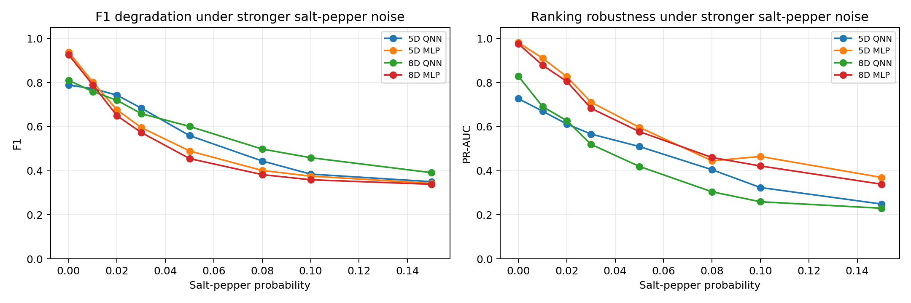

# QNN 噪声鲁棒性实验汇报

更新时间：2026-06-29

## 1. 研究背景与问题

本项目原本已经在 QPP-inspired few-qubit QNN 主线上验证过 1-qubit / 2-qubit QNN 在部分噪声条件下相对 baseline 具有更稳定的表现。今天进一步回到更接近早期计划书的 5D / 8D patch-level QNN 设置，验证一个更具体的问题：

> 当 salt-and-pepper 噪声逐渐增强时，5D 和 8D QNN 是否比同特征 MLP 表现出更强的抗噪声能力？

这里的重点不是证明 QNN 在所有场景下超过 classical baseline，而是观察在固定阈值检测协议下，QNN 的 F1 是否随脉冲型噪声增强而退化得更慢。

## 2. 实验方案设计

### 2.1 特征设置

本次实验比较两类输入特征：

| 特征维度 | 特征向量 |
| --- | --- |
| 5D | `[Ix, Iy, lambda1, lambda2, R]` |
| 8D | `[Ix, Iy, Ix2, Iy2, IxIy, lambda1, lambda2, R]` |

其中 `lambda1` 和 `lambda2` 来自局部 structure tensor 的特征值，`R` 为 Harris response。8D 版本额外保留了 `Ix2`、`Iy2` 和 `IxIy` 等局部梯度二阶统计量。

### 2.2 训练与测试协议

实验采用统一协议：

- 训练：只使用 clean train split。
- 阈值选择：只在 clean validation split 上选择 best-F1 threshold。
- 测试：对 held-out test images 加噪声后重新提取 patch features。
- 阈值固定：所有噪声强度测试都使用 clean validation 上选出的阈值，不在噪声测试集上重新调阈值。
- 测试规模：1500 个 held-out test patches。

这样做的目的是避免对噪声测试集进行调参，使不同噪声强度下的退化趋势更公平。

### 2.3 对比模型

本次主要比较：

- 5D QNN
- 8D QNN
- 5D MLP
- 8D MLP
- Harris / FAST / ORB image-level classical detectors

其中 MLP 使用与 QNN 相同的输入特征，因此 5D QNN 对应 5D MLP，8D QNN 对应 8D MLP。

### 2.4 数据对齐说明

实验时发现仓库中已有的 `data/feature_dataset.npz` 和 `data/feature_dataset_extended.npz` 并不是完全相同的 split / labels 协议。为了保证 5D 和 8D 比较公平，实验脚本会生成一份对齐数据副本：

```text
outputs/feature_dim_noise_comparison_data/
```

后续 5D / 8D 实验都基于这份对齐后的数据协议执行。

## 3. 指标解释

### 3.1 Precision、Recall 和 F1

在 patch-level keypoint detection 中，模型会为每个 patch 输出一个分数或概率。分数超过阈值时，预测为 keypoint；否则预测为 non-keypoint。

定义：

```text
Precision = TP / (TP + FP)
Recall    = TP / (TP + FN)
F1        = 2 * Precision * Recall / (Precision + Recall)
```

其中：

- `TP`：模型预测为 keypoint，真实标签也是 keypoint。
- `FP`：模型预测为 keypoint，但真实不是 keypoint，即误检。
- `FN`：真实是 keypoint，但模型没有检测出来，即漏检。

F1 是固定阈值下的指标。它反映的是在当前阈值下，模型在误检和漏检之间取得的平衡。

### 3.2 阈值是什么意思

阈值是把模型连续分数转换为二分类结果的判定线。例如阈值为 `0.5` 时：

```text
score >= 0.5 -> keypoint
score <  0.5 -> non-keypoint
```

阈值越低，模型越容易预测 keypoint，Recall 通常会上升，但 Precision 可能下降。阈值越高，模型越谨慎，Precision 可能上升，但 Recall 可能下降。

本次实验中，阈值只在 clean validation set 上选择一次，然后固定用于所有噪声测试。

### 3.3 PR-AUC 和排序能力

PR-AUC 是 Precision-Recall 曲线下面积。它不只看某一个阈值，而是把模型输出分数从高到低扫过许多阈值，观察 Precision 和 Recall 的整体变化。

直观理解：

> PR-AUC 衡量模型能不能把真正的 keypoint 排在 non-keypoint 前面。

因此：

- F1 高：说明当前固定阈值下检测效果好。
- PR-AUC 高：说明模型整体排序能力强。
- F1 高但 PR-AUC 不高：说明当前阈值下表现不错，但整体排序未必全面优于对手。

本次实验中，QNN 的优势主要体现在固定阈值 F1 鲁棒性，而不是 PR-AUC 全面超过 MLP。

## 4. 实验一：Clean 与单点噪声对比

实验输出文件：

- `outputs/feature_dim_noise_comparison.csv`
- `outputs/feature_dim_noise_comparison.json`
- `outputs/feature_dim_noise_comparison.png`
- `outputs/feature_dim_noise_summary.md`


### 4.1 Clean 条件下 MLP 仍然更强

| 模型 | F1 | PR-AUC |
| --- | ---: | ---: |
| 5D MLP | 0.9430 | 0.9832 |
| 5D QNN | 0.7890 | 0.7272 |
| 8D MLP | 0.9338 | 0.9771 |
| 8D QNN | 0.8105 | 0.8289 |

Clean 条件下，MLP 在 F1 和 PR-AUC 上都明显强于 QNN。这说明不能声称 QNN 在无噪声条件下全面超过 classical learner。

但 QNN 已经具备有效判别能力：5D QNN F1 为 `0.7890`，8D QNN F1 为 `0.8105`。8D 相比 5D 在 clean 条件下略有提升，说明扩展结构张量特征能够提高 QNN 的表达能力。

### 4.2 Salt-pepper 0.03 下 QNN 的 F1 退化更小

| 模型 | Clean F1 | Salt-pepper 0.03 F1 | F1 下降 |
| --- | ---: | ---: | ---: |
| 5D MLP | 0.9430 | 0.5774 | 0.3655 |
| 5D QNN | 0.7890 | 0.6842 | 0.1048 |
| 8D MLP | 0.9338 | 0.5611 | 0.3726 |
| 8D QNN | 0.8105 | 0.6593 | 0.1512 |

这个结果是第一层核心结论：在 `saltpepper_0.03` 下，QNN 的 clean F1 虽然低于 MLP，但噪声后 F1 下降幅度远小于 MLP。

更具体地说，5D MLP 从 `0.9430` 下降到 `0.5774`，而 5D QNN 从 `0.7890` 下降到 `0.6842`。8D 情况也类似，8D MLP 下降 `0.3726`，8D QNN 只下降 `0.1512`。

### 4.3 Precision / Recall 变化

在 `saltpepper_0.03` 下：

| 模型 | Precision | Recall | F1 | PR-AUC |
| --- | ---: | ---: | ---: | ---: |
| 5D MLP | 0.4123 | 0.9633 | 0.5774 | 0.7048 |
| 5D QNN | 0.5482 | 0.9100 | 0.6842 | 0.5665 |
| 8D MLP | 0.3921 | 0.9867 | 0.5611 | 0.6775 |
| 8D QNN | 0.5224 | 0.8933 | 0.6593 | 0.5198 |

MLP 在 salt-pepper 下 Recall 很高，但 Precision 大幅下降，说明它把大量非关键点 patch 也判成了 keypoint，误检增多。QNN 的 Recall 略低，但 Precision 更高，因此固定阈值下的 F1 更好。

需要注意，MLP 的 PR-AUC 仍然高于 QNN。这说明 MLP 的整体排序能力没有完全崩掉；QNN 的优势主要是固定阈值下更不容易发生误检膨胀。

## 5. 实验二：Salt-pepper 噪声强度逐渐增强

实验输出文件：

- `outputs/saltpepper_sweep_5d8d.csv`
- `outputs/saltpepper_sweep_5d8d.json`
- `outputs/saltpepper_sweep_5d8d.png`
- `outputs/saltpepper_sweep_5d8d_summary.md`



### 5.1 F1 趋势表

| Salt-pepper | 5D QNN | 5D MLP | 8D QNN | 8D MLP |
| ---: | ---: | ---: | ---: | ---: |
| 0.00 | 0.7890 | 0.9430 | 0.8105 | 0.9338 |
| 0.01 | 0.7726 | 0.7840 | 0.7592 | 0.7628 |
| 0.02 | 0.7430 | 0.6667 | 0.7197 | 0.6358 |
| 0.03 | 0.6842 | 0.5774 | 0.6593 | 0.5611 |
| 0.05 | 0.5592 | 0.4779 | 0.6011 | 0.4471 |
| 0.08 | 0.4443 | 0.3968 | 0.4982 | 0.3814 |
| 0.10 | 0.3847 | 0.3722 | 0.4592 | 0.3589 |
| 0.15 | 0.3503 | 0.3409 | 0.3911 | 0.3407 |

从趋势上看，MLP 在很轻微的 salt-pepper 噪声下就出现明显 F1 下滑。例如：

- 5D MLP：`0.9430 -> 0.7840`，噪声强度仅为 `0.01`。
- 8D MLP：`0.9338 -> 0.7628`，噪声强度仅为 `0.01`。

相比之下，QNN 的下降更平缓：

- 5D QNN：`0.7890 -> 0.7726`
- 8D QNN：`0.8105 -> 0.7592`

### 5.2 从 0.00 到 0.15 的总体退化

| 模型 | F1 at 0.00 | F1 at 0.15 | F1 下降 |
| --- | ---: | ---: | ---: |
| 5D MLP | 0.9430 | 0.3409 | 0.6020 |
| 5D QNN | 0.7890 | 0.3503 | 0.4387 |
| 8D MLP | 0.9338 | 0.3407 | 0.5930 |
| 8D QNN | 0.8105 | 0.3911 | 0.4193 |

这是第二层核心结论：

> 随着 salt-pepper 噪声强度从 `0.00` 增加到 `0.15`，5D 和 8D QNN 的 F1 下降幅度均小于对应 MLP。

这说明 QNN 在脉冲型噪声逐渐增强时表现出更强的固定阈值抗噪声稳定性。

### 5.3 5D 与 8D 的差异

Clean 条件下，8D QNN 略强于 5D QNN：

```text
5D QNN clean F1 = 0.7890
8D QNN clean F1 = 0.8105
```

在 `saltpepper_0.03` 下，5D QNN 略强于 8D QNN：

```text
5D QNN F1 = 0.6842
8D QNN F1 = 0.6593
```

但在更强噪声下，8D QNN 又开始更稳定：

```text
saltpepper_0.08: 5D QNN = 0.4443, 8D QNN = 0.4982
saltpepper_0.15: 5D QNN = 0.3503, 8D QNN = 0.3911
```

因此不能简单说 8D 一定比 5D 更抗噪。更准确的解释是：8D 特征提升了 clean 表达能力，也在强 salt-pepper 噪声下保持略高 F1；但额外的梯度二阶统计量可能在中等噪声下引入更多敏感通道，使 8D QNN 在 `0.03` 附近略低于 5D QNN。

## 6. 汇报结论

本次实验可以汇报为：

> 在 clean training + fixed clean-validation threshold 协议下，MLP 在 clean 条件下仍然取得更高 F1 和 PR-AUC，说明 classical learner 具有更强的无噪声判别能力。然而，当 salt-and-pepper 噪声逐渐增强时，5D 与 8D QNN 的 F1 下降幅度均小于对应 MLP。特别是在 `saltpepper_0.03` 下，5D QNN F1 为 `0.6842`，高于 5D MLP 的 `0.5774`；8D QNN F1 为 `0.6593`，高于 8D MLP 的 `0.5611`。进一步的 sweep 实验显示，从噪声强度 `0.00` 增至 `0.15`，5D QNN 的 F1 下降 `0.4387`，小于 5D MLP 的 `0.6020`；8D QNN 的 F1 下降 `0.4193`，小于 8D MLP 的 `0.5930`。这说明 QNN 在脉冲型噪声下具有更强的固定阈值检测鲁棒性。

同时需要保留限制性表述：

> 当前结果不能表述为 QNN 全面优于 MLP 或证明稳定量子优势。QNN 的优势主要体现在 salt-pepper 噪声下固定阈值 F1 的退化更小；在 clean 条件和 PR-AUC 排序能力上，MLP 仍然更强。

## 7. 后续工作建议

后续可以继续做三类实验：

1. 多随机种子重复实验，报告均值和方差，确认趋势不是单次 seed 偶然结果。
2. 加入 noise-aware training，对比 clean-trained QNN 和 noise-aware QNN 在 salt-pepper 下的恢复能力。
3. 做 8D 特征通道消融，分析 `Ix2`、`Iy2`、`IxIy` 等额外特征在 salt-pepper 噪声下是提供有效信息，还是引入噪声敏感通道。

## 8. 相关脚本与输出

本次新增/使用的脚本：

- `scripts/run_5d8d_noise_comparison.py`
- `scripts/run_saltpepper_sweep_5d8d.py`

主要输出：

- `outputs/feature_dim_noise_comparison.csv`
- `outputs/feature_dim_noise_comparison.png`
- `outputs/feature_dim_noise_summary.md`
- `outputs/saltpepper_sweep_5d8d.csv`
- `outputs/saltpepper_sweep_5d8d.png`
- `outputs/saltpepper_sweep_5d8d_summary.md`

