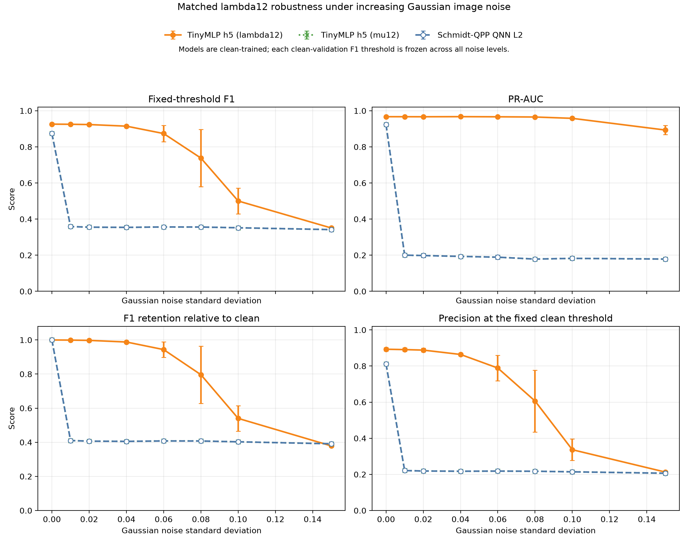

# Schmidt-QPP 与经典 MLP 的高斯噪声鲁棒性对比

更新时间：2026-08-12

## 1. 实验目的

本实验补充考察显式 Schmidt-QPP 在逐渐增强的高斯图像噪声下，是否比参数量相近的经典 MLP 更能保持角点分类性能。所有模型只在干净数据上训练，并在测试图像上施加不同强度的高斯噪声：

```text
I_noisy = clip(I + epsilon, 0, 1),  epsilon ~ N(0, sigma^2).
```

噪声注入后，在原测试中心重新截取 patch、计算结构张量及其特征值。实验重点报告固定干净验证阈值下的 F1、Precision、Recall，以及与阈值无关的 PR-AUC。

仓库中没有找到初稿原始 Schmidt-QPP 训练脚本或检查点。因此，本实验使用此前依据初稿状态制备、浅层变分电路和读出原则重建的 25 参数显式 Schmidt-QPP。本文结果是新的可复现实验，不是初稿旧表格数字的直接复现。

## 2. 模型与对照

### 2.1 显式 Schmidt-QPP

模型输入为有序非负结构张量特征值

```text
lambda1 >= lambda2 >= 0,
```

并计算归一化谱

```text
mu_i = lambda_i / (lambda1 + lambda2).
```

两量子比特 Schmidt 态为

```text
|psi_mu> = sqrt(mu1)|00> + sqrt(mu2)|11>.
```

态制备后接两层局部 `Rz-Ry-Rz` 旋转和 `CNOT(0 -> 1)`，再由 12 个 Pauli/关联观测量和一个仿射头输出分类 logit，共有 25 个可训练参数。

### 2.2 两个经典 MLP 对照

两个 TinyMLP 均为 `2 -> 5 -> 1`，各有 21 个可训练参数。

| 模型 | 输入 | 对照目的 |
| --- | --- | --- |
| `TinyMLP h5 (lambda12)` | 原始谱 `[lambda1, lambda2]` | 保留总能量 `S=lambda1+lambda2` 的同输入、近参数量经典对照 |
| `TinyMLP h5 (mu12)` | 归一化谱 `[mu1, mu2]` | 与 Schmidt 态实际编码信息一致的表示匹配对照 |

Schmidt 态对 `[lambda1, lambda2] -> c[lambda1, lambda2]` 不变，因此会丢失总能量 `S`。加入 `mu12`-TinyMLP 是为了区分“量子分类器结构”与“归一化输入表示”各自的影响。

## 3. 实验协议

- 数据：`data/feature_dataset_extended.npz`。
- 划分：沿用已有的图像互斥 train/validation/test split。
- 样本数：训练 4500、验证 1500、测试 1500；训练集正样本比例为 20%。
- patch 大小：`9 x 9`。
- 高斯噪声标准差：`0, 0.01, 0.02, 0.04, 0.06, 0.08, 0.10, 0.15`。
- 噪声施加顺序：完整 held-out 测试图像加噪并裁剪至 `[0,1]`，然后在原测试坐标重新提取 patch 和结构张量谱。
- 训练随机种子：`17, 29, 41, 53, 67`。
- 每个非零噪声强度使用 3 个噪声种子：`1001, 2003, 3001`。
- 训练：Adam，学习率 0.01，最多 60 轮，验证 PR-AUC 早停，patience 为 10。
- 阈值：每个模型只在干净验证集上按最佳 F1 选择一次，此后对所有噪声强度冻结，禁止按测试噪声重新调阈值。
- 汇总：先对同一训练种子的 3 个噪声实例求平均，再在 5 个训练种子间求均值；表中的 `+/-` 是所有原始评估的描述性标准差。

复现命令：

```powershell
D:\anaconda\envs\qsnn\python.exe scripts\run_schmidt_qpp_gaussian_comparison.py
```

## 4. 实验结果



### 4.1 固定干净阈值下的 F1

| 高斯噪声 sigma | Schmidt-QPP | TinyMLP `lambda12` | TinyMLP `mu12` |
| ---: | ---: | ---: | ---: |
| 0.00 | 0.8738 +/- 0.0000 | **0.9259 +/- 0.0049** | 0.8738 +/- 0.0000 |
| 0.01 | 0.3586 +/- 0.0000 | **0.9250 +/- 0.0051** | 0.3586 +/- 0.0000 |
| 0.02 | 0.3553 +/- 0.0001 | **0.9235 +/- 0.0052** | 0.3553 +/- 0.0001 |
| 0.04 | 0.3542 +/- 0.0010 | **0.9147 +/- 0.0033** | 0.3542 +/- 0.0010 |
| 0.06 | 0.3564 +/- 0.0016 | **0.8737 +/- 0.0456** | 0.3564 +/- 0.0016 |
| 0.08 | 0.3561 +/- 0.0016 | **0.7379 +/- 0.1580** | 0.3561 +/- 0.0016 |
| 0.10 | 0.3520 +/- 0.0017 | **0.5003 +/- 0.0708** | 0.3520 +/- 0.0017 |
| 0.15 | 0.3417 +/- 0.0017 | **0.3507 +/- 0.0087** | 0.3417 +/- 0.0017 |

结果不支持“当前 Schmidt-QPP 比参数相近的原始谱 MLP 更耐高斯噪声”。`lambda12`-TinyMLP 在全部噪声强度下的绝对 F1 都更高；在 `sigma=0.04` 时，两者 F1 分别为 0.9147 和 0.3542，配对平均差 `Schmidt - MLP = -0.5605`。

Schmidt-QPP 在 `sigma=0.01` 时 F1 已由 0.8738 降至 0.3586。此时 Precision 从 0.8114 降至 0.2212，而 Recall 仍为 0.9467，说明固定阈值下出现了大量假阳性，而不是模型停止检出所有角点。

### 4.2 PR-AUC

| 高斯噪声 sigma | Schmidt-QPP | TinyMLP `lambda12` | TinyMLP `mu12` |
| ---: | ---: | ---: | ---: |
| 0.00 | 0.9229 +/- 0.0000 | **0.9670 +/- 0.0036** | 0.9229 +/- 0.0000 |
| 0.01 | 0.2003 +/- 0.0035 | **0.9669 +/- 0.0032** | 0.2003 +/- 0.0035 |
| 0.02 | 0.1982 +/- 0.0106 | **0.9667 +/- 0.0032** | 0.1982 +/- 0.0106 |
| 0.04 | 0.1934 +/- 0.0069 | **0.9672 +/- 0.0031** | 0.1934 +/- 0.0069 |
| 0.06 | 0.1891 +/- 0.0113 | **0.9665 +/- 0.0038** | 0.1891 +/- 0.0113 |
| 0.08 | 0.1785 +/- 0.0067 | **0.9653 +/- 0.0041** | 0.1785 +/- 0.0067 |
| 0.10 | 0.1825 +/- 0.0079 | **0.9579 +/- 0.0042** | 0.1825 +/- 0.0079 |
| 0.15 | 0.1787 +/- 0.0028 | **0.8931 +/- 0.0255** | 0.1787 +/- 0.0028 |

PR-AUC 给出了比固定阈值 F1 更清晰的判断。`lambda12`-TinyMLP 在 `sigma=0.15` 时 F1 已接近全预测为正类的退化区，但 PR-AUC 仍为 0.8931，说明其分数排序仍保留大量判别信息，重新校准阈值可能恢复一部分分类性能。Schmidt-QPP 从 `sigma=0.01` 开始的 PR-AUC 约为 0.20，已经接近本数据 20% 正样本比例下的随机排序基线。

### 4.3 F1 保留率

| 高斯噪声 sigma | Schmidt-QPP | TinyMLP `lambda12` |
| ---: | ---: | ---: |
| 0.01 | 0.4104 | **0.9991** |
| 0.02 | 0.4066 | **0.9975** |
| 0.04 | 0.4053 | **0.9879** |
| 0.06 | 0.4079 | **0.9435** |
| 0.08 | 0.4075 | **0.7962** |
| 0.10 | 0.4028 | **0.5401** |
| 0.15 | **0.3911** | 0.3787 |

在 `sigma=0.15` 时 Schmidt-QPP 的相对 F1 保留率略高，但不能把这一点解释为有效的抗噪优势：其绝对 F1 仍更低，PR-AUC 只有 0.1787，Precision 仅 0.2063、Recall 为 0.9944，模型已接近将所有 patch 判为正类。较低的干净基线也会使相对保留率更容易显得较高。

## 5. 表示匹配对照与机制分析

### 5.1 Schmidt-QPP 与 `mu12`-TinyMLP 重合

在全部噪声强度下，`mu12`-TinyMLP 和 Schmidt-QPP 的 F1、Precision、Recall 完全相同，PR-AUC 也仅有浮点误差量级的差别。两条曲线在结果图中重合。

这不是所有量子模型与 MLP 必然等价的理论结论，而是当前数据和模型下的实验观察。它表明：当两个模型都只能使用归一化谱中的一个独立自由度时，25 参数 Schmidt-QPP 并未产生超出 21 参数经典 MLP 的可观测判别能力。当前主要瓶颈是输入归一化丢失的信息，而不是经典 MLP 参数量不足。

### 5.2 轻微高斯噪声为何会破坏归一化谱

为了验证这一解释，额外统计了总能量 `S=lambda1+lambda2` 和归一化次特征值 `mu2`：

| 条件 | 类别 | `S` 中位数 | `mu2` 中位数 |
| --- | --- | ---: | ---: |
| clean | 负类 | 0.0000 | 0.0000 |
| clean | 正类 | 5.1234 | 0.3738 |
| sigma=0.01 | 负类 | 0.0141 | 0.4202 |
| sigma=0.01 | 正类 | 5.1257 | 0.3746 |
| sigma=0.04 | 负类 | 0.2118 | 0.4207 |
| sigma=0.04 | 正类 | 5.2757 | 0.3810 |

许多干净负类 patch 原本近乎平坦，两个特征值都接近零。加入很小的各向同性高斯扰动后，它们产生了低能量但两个特征值比例接近的结构张量；归一化会把这个很小的能量放大为较大的 `mu2`，在比例形状上反而像角点。Schmidt-QPP 和 `mu12`-TinyMLP 看不到该 patch 的 `S` 仍然极小，因此出现大量假阳性。

原始谱 MLP 同时保留了比例和能量。在 `sigma=0.01` 时，负类 `S` 中位数仅为 0.0141，而正类为 5.1257，这个尺度差异使它仍能有效区分弱噪声纹理与真实高能角点。

因此，数据支持的机制解释是：

> 纯 Schmidt 归一化谱对整体强度缩放不变，但这种不变性同时移除了角点检测所需的局部梯度能量；对低幅值高斯噪声而言，这不是鲁棒性，而是信息损失。

## 6. 可用于论文的结论与限制

本实验适合作为模型边界、消融结果或补充材料，不能作为 Schmidt-QPP 的性能优势图。可采用如下表述：

> Under clean-only training and a frozen clean-validation threshold, the reconstructed Schmidt-QPP model was highly sensitive to pixel-level Gaussian corruption. A representation-matched TinyMLP using the same normalized spectrum reproduced its metrics almost exactly, whereas a parameter-comparable TinyMLP retaining the unnormalized eigenvalues remained substantially more robust. The result indicates that discarding total tensor energy, rather than insufficient classical capacity, is the dominant limitation of the present Schmidt encoding.

结论的适用范围需要限定：

- 这是重建的显式 Schmidt-QPP，不是缺失的初稿原模型检查点；
- 所有模型只在干净样本上训练，实验评价的是零样本噪声迁移，不代表噪声感知训练后的上限；
- 结果否定的是当前“纯归一化谱 + 两层电路”配置，不能外推为所有 QPP 或所有量子模型都不抗高斯噪声；
- `lambda12`-TinyMLP 保留了 Schmidt 态没有编码的总能量，因此它既是工程基线，也是定位表示瓶颈的必要对照。

下一步优先级最高的改进是 energy-aware Schmidt-QPP，例如额外编码

```text
[log(S + eps), mu2]
```

或给量子读出增加独立的经典能量旁路，再与使用完全相同表示的 MLP 对比。之后还应补充 Gaussian noise-aware training，区分“表示上限”和“训练分布不匹配”两种影响。

## 7. 代码与输出

实验脚本：

- `scripts/run_schmidt_qpp_gaussian_comparison.py`

结果目录：`outputs/schmidt_qpp_gaussian_noise/`

- `protocol.json`：完整协议、运行环境和耗时；
- `schmidt_qpp_gaussian_raw.csv`：330 条逐训练种子、逐噪声实例结果；
- `schmidt_qpp_gaussian_summary.csv`：3 个模型乘 8 个噪声强度，共 24 条汇总结果；
- `schmidt_qpp_gaussian_paired_differences.csv`：Schmidt-QPP 相对两个 MLP 的配对差异；
- `schmidt_qpp_gaussian_results.json`：完整结构化结果；
- `schmidt_qpp_gaussian_comparison.png`：F1、PR-AUC、F1 保留率和 Precision 四联图；
- `runs/seed_*/`：各训练种子的最佳权重和训练历史。

运行环境：Python 3.12.13、NumPy 2.4.4、PyTorch 2.12.1+cu132；实际设备为 CPU，完整实验耗时约 46 秒。

