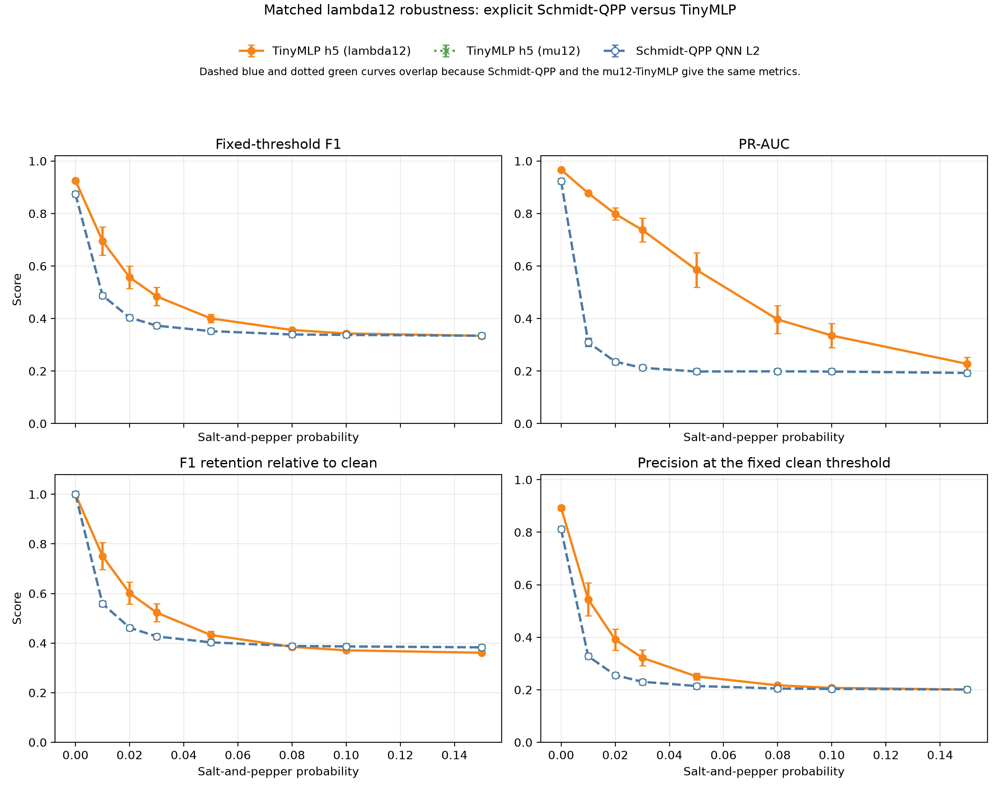

# Schmidt-QPP 与经典 MLP 的椒盐噪声鲁棒性对比

更新时间：2026-08-12

## 1. 实验目的

现有 `qnn_noise_robustness_report.md` 比较了 5D/8D 数据重上传 QNN 与对应 MLP，但不能回答显式 Schmidt-QPP 是否比经典模型更耐椒盐噪声。本实验补齐这一缺口，考察：

> 在图像级划分、训练数据、输入特征、阈值协议和噪声实现受控的条件下，显式 Schmidt-QPP 与经典 TinyMLP 的固定阈值 F1 和 PR-AUC 如何随椒盐噪声增强而变化？

需要说明的是，仓库中没有找到初稿所列的 `scripts/run_schmidt_qpp_experiments.py` 或旧 Schmidt-QPP 检查点。因此，本实验是依据初稿中的状态制备、浅层变分和读出原则重新构建的可复现实验，不是对初稿 Table 7 数字的直接复现。

## 2. 模型与表示

### 2.1 显式 Schmidt-QPP

输入为结构张量的有序非负特征值

```text
x = [lambda1, lambda2],  lambda1 >= lambda2 >= 0.
```

首先计算归一化谱

```text
mu_i = lambda_i / (lambda1 + lambda2),
```

并显式制备

```text
|psi_mu> = sqrt(mu1)|00> + sqrt(mu2)|11>.
```

态制备后使用两层局部 `Rz-Ry-Rz` 变分旋转和 `CNOT(0 -> 1)`。读出包含 6 个局部 Pauli 期望、3 个同轴关联期望和 3 个对称交叉关联期望，并接一个仿射头。

参数量为：

```text
两层局部旋转：2 layers * 2 qubits * 3 angles = 12
12 维仿射头：12 weights + 1 bias              = 13
总计                                                    = 25
```

### 2.2 两个经典对照

两个经典模型都使用单隐藏层 5 单元 TinyMLP，结构为 `2 -> 5 -> 1`，共有 21 个可训练参数。

| 模型 | 输入 | 用途 |
| --- | --- | --- |
| `TinyMLP h5 (lambda12)` | 原始有序谱 `[lambda1, lambda2]` | 同原始输入、近似参数量对照；保留总能量 `S=lambda1+lambda2` |
| `TinyMLP h5 (mu12)` | 归一化谱 `[mu1, mu2]` | 表示匹配对照；只使用 Schmidt 态实际保留的信息 |

加入 `mu12` 对照很重要。显式 Schmidt 态只依赖归一化谱，因而对整体缩放

```text
[lambda1, lambda2] -> c * [lambda1, lambda2]
```

保持不变。原始 `lambda12` MLP 则还可以使用局部总梯度能量。因此，只有同时报告这两个经典对照，才能区分模型结构影响和输入信息丢失。

## 3. 受控实验协议

- 数据：`data/feature_dataset_extended.npz`。
- 划分：已有的图像互斥 train/validation/test split。
- 训练样本：4500；验证样本：1500；测试样本：1500。
- 正样本比例：训练集 20%。
- 所有模型使用完全相同的训练、验证和测试 patch。
- 训练随机种子：`17, 29, 41, 53, 67`。
- 非零噪声条件使用 3 个独立噪声种子：`1001, 2003, 3001`。
- 椒盐噪声概率：`0, 0.01, 0.02, 0.03, 0.05, 0.08, 0.10, 0.15`。
- 噪声直接施加到 held-out test images，然后在相同测试中心重新提取 patch 和结构张量特征。
- 每个训练种子的分类阈值只在干净验证集上按最佳 F1 选择一次；所有噪声强度保持该阈值不变。
- 两类模型均使用 Adam、最多 60 轮、验证 PR-AUC 早停、patience 10。
- 汇总均值先在每个训练种子内部对 3 个噪声实例取平均，再在 5 个训练种子之间平均。
- 图中误差棒是全部原始评估的描述性标准差，同时受训练种子与噪声实例影响。

运行命令：

```powershell
D:\anaconda\envs\qsnn\python.exe scripts\run_schmidt_qpp_saltpepper_comparison.py
```

## 4. 主要结果



### 4.1 固定干净阈值下的 F1

下表给出均值和全部原始评估的描述性标准差：

| 椒盐概率 | Schmidt-QPP | TinyMLP `lambda12` | TinyMLP `mu12` |
| ---: | ---: | ---: | ---: |
| 0.00 | 0.8738 +/- 0.0000 | **0.9259 +/- 0.0049** | 0.8738 +/- 0.0000 |
| 0.01 | 0.4882 +/- 0.0086 | **0.6956 +/- 0.0539** | 0.4882 +/- 0.0086 |
| 0.02 | 0.4038 +/- 0.0007 | **0.5570 +/- 0.0433** | 0.4038 +/- 0.0007 |
| 0.03 | 0.3730 +/- 0.0014 | **0.4843 +/- 0.0350** | 0.3730 +/- 0.0014 |
| 0.05 | 0.3522 +/- 0.0010 | **0.4006 +/- 0.0162** | 0.3522 +/- 0.0010 |
| 0.08 | 0.3394 +/- 0.0010 | **0.3564 +/- 0.0065** | 0.3394 +/- 0.0010 |
| 0.10 | 0.3378 +/- 0.0007 | **0.3433 +/- 0.0031** | 0.3378 +/- 0.0007 |
| 0.15 | 0.3346 +/- 0.0008 | 0.3344 +/- 0.0005 | 0.3346 +/- 0.0008 |

结果不支持“Schmidt-QPP 比同输入经典 MLP 更耐椒盐噪声”的假设。在 clean 至 `p=0.10` 范围内，保留原始 `lambda12` 的 TinyMLP 的绝对 F1 均高于 Schmidt-QPP；二者只在极强噪声 `p=0.15` 时收敛到约 0.334。

在 `p=0.03` 时：

```text
Schmidt-QPP F1             = 0.3730
lambda12-TinyMLP F1        = 0.4843
配对平均差 Schmidt - MLP   = -0.1114
```

### 4.2 PR-AUC

| 椒盐概率 | Schmidt-QPP | TinyMLP `lambda12` | TinyMLP `mu12` |
| ---: | ---: | ---: | ---: |
| 0.00 | 0.9229 +/- 0.0000 | **0.9670 +/- 0.0036** | 0.9229 +/- 0.0000 |
| 0.01 | 0.3098 +/- 0.0157 | **0.8778 +/- 0.0078** | 0.3098 +/- 0.0157 |
| 0.02 | 0.2357 +/- 0.0034 | **0.7986 +/- 0.0232** | 0.2357 +/- 0.0034 |
| 0.03 | 0.2125 +/- 0.0002 | **0.7375 +/- 0.0457** | 0.2125 +/- 0.0002 |
| 0.05 | 0.1983 +/- 0.0024 | **0.5855 +/- 0.0658** | 0.1983 +/- 0.0024 |
| 0.08 | 0.1991 +/- 0.0057 | **0.3965 +/- 0.0531** | 0.1991 +/- 0.0057 |
| 0.10 | 0.1982 +/- 0.0077 | **0.3353 +/- 0.0461** | 0.1982 +/- 0.0077 |
| 0.15 | 0.1929 +/- 0.0053 | **0.2274 +/- 0.0249** | 0.1929 +/- 0.0053 |

PR-AUC 的差距比 F1 更明显。`lambda12`-TinyMLP 在 `p=0.03` 时仍有 0.7375 PR-AUC，而 Schmidt-QPP 仅为 0.2125，接近 20% 正样本比例下的随机排序基线。这说明 TinyMLP 的整体排序能力仍然存在；Schmidt-QPP 的归一化谱分数排序则在很轻的椒盐噪声下就接近失效。

### 4.3 F1 下降和保留率

| 椒盐概率 | Schmidt-QPP 保留率 | `lambda12`-TinyMLP 保留率 |
| ---: | ---: | ---: |
| 0.01 | 0.5587 | **0.7510** |
| 0.02 | 0.4621 | **0.6014** |
| 0.03 | 0.4268 | **0.5230** |
| 0.05 | 0.4030 | **0.4326** |
| 0.08 | **0.3884** | 0.3849 |
| 0.10 | **0.3866** | 0.3708 |
| 0.15 | **0.3829** | 0.3612 |

在 `p>=0.08` 时，Schmidt-QPP 的相对保留率数值略高，但这不能解释为有意义的鲁棒性优势。此时两类模型的 Precision 已接近正样本比例 0.2、Recall 接近 1，F1 接近 0.333，意味着模型几乎把所有 patch 都预测为正类。相对保留率的微小交叉发生在两个模型都已严重失效的区域。

## 5. 表示匹配对照揭示的机制

`mu12`-TinyMLP 与 Schmidt-QPP 在所有噪声强度下得到相同的 F1、Precision、Recall 和几乎完全相同的 PR-AUC。两条曲线在图中重合。

这说明在当前数据上：

1. Schmidt-QPP 的可用输入信息主要就是归一化谱中的一个自由度；
2. 25 参数量子电路没有在该二特征任务上形成超出 21 参数 `mu12`-TinyMLP 的可观测判别能力；
3. `lambda12`-TinyMLP 的优势主要来自它还保留了总梯度能量 `S=lambda1+lambda2`；
4. 椒盐噪声会制造大量高能局部梯度。只保留谱比例而丢弃能量尺度，会使真实角点和噪声脉冲更难区分。

因此，本实验更支持如下设计判断：

> 纯归一化 Schmidt 谱适合表达方向平衡和各向同性，但对于椒盐噪声下的角点检测，仅有归一化谱是不充分的；模型还需要显式保留总能量或其他幅值信息。

## 6. 与现有 5D/8D 噪声报告的关系

该结果不与 5D/8D QNN 报告矛盾。两组实验研究的模型和输入不同：

- 5D/8D QNN保留中心梯度、结构张量二阶量、特征值和 Harris response 等幅值信息；
- 当前 Schmidt-QPP 只把归一化谱写入量子态；
- 5D/8D 报告中的 QNN 与 MLP 训练样本数并不完全匹配；
- 当前实验为三类模型统一使用全部 4500 个训练样本。

所以不能把 5D/8D QNN 的固定阈值退化趋势直接外推到显式 Schmidt-QPP。

## 7. 对论文 1.5 的建议

本实验可以写进正文或补充材料，但应作为边界结果，而不是优势结果。推荐表述：

> Under the matched clean-training and fixed-threshold protocol, the reconstructed explicit Schmidt-QPP model did not outperform a parameter-comparable TinyMLP operating on the same ordered eigenvalues. A representation-matched TinyMLP using only the normalized spectrum reproduced the Schmidt-QPP metrics almost exactly, indicating that the principal limitation is the loss of total tensor energy rather than classifier capacity alone.

正文中不建议写：

- “Schmidt-QPP 比经典 MLP 更抗椒盐噪声”；
- “量子纠缠带来了噪声鲁棒性”；
- “强噪声下更高的相对 F1 保留率说明模型仍然有效”。

下一步最值得补充的模型不是继续增加相同的变分层，而是构建能同时保留

```text
[log(S + eps), mu2] 或 [log(S + eps), eta]
```

的 energy-aware Schmidt-QPP，再与同表示 TinyMLP 进行匹配比较。

## 8. 代码与输出

实现：

- `qpp_corner_qnn_github_package/src/qpp_corner/qnn_torch.py`
  - 新增 `SchmidtQPPQNN2`；
  - 新增两量子比特 Pauli 期望支持；
  - 显式 Schmidt 态制备；
  - 两层 25 参数结构。
- `qpp_corner_qnn_github_package/tests/test_qnn_forward.py`
  - 检查制备态振幅；
  - 检查归一化；
  - 检查 25 参数；
  - 检查反向传播。
- `scripts/run_schmidt_qpp_saltpepper_comparison.py`
  - 完整受控训练和噪声扫描；
  - 多训练种子和多噪声种子；
  - 原始指标、汇总指标、成对差异和结果图。

输出目录：`outputs/schmidt_qpp_noise/`

- `protocol.json`：完整运行协议与环境版本；
- `schmidt_qpp_saltpepper_raw.csv`：330 条种子级原始评估；
- `schmidt_qpp_saltpepper_summary.csv`：各模型各噪声强度汇总；
- `schmidt_qpp_saltpepper_paired_differences.csv`：Schmidt-QPP 与两个 MLP 的配对差异；
- `schmidt_qpp_saltpepper_results.json`：完整结构化结果；
- `schmidt_qpp_saltpepper_comparison.png`：主结果图；
- `runs/seed_*/`：各训练种子的模型权重与训练历史。

## 9. 复现说明

运行环境：

```text
Python 3.12.13
NumPy 2.4.4
PyTorch 2.12.1+cu132
实际运行设备：CPU
```

完整实验在当前机器上耗时约 49 秒。脚本提供 `--help`、显式种子控制及 `--smoke` 冒烟模式。
