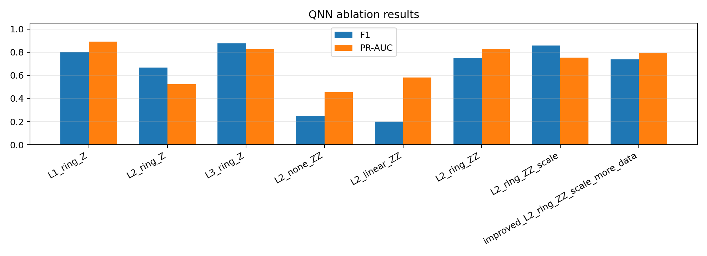
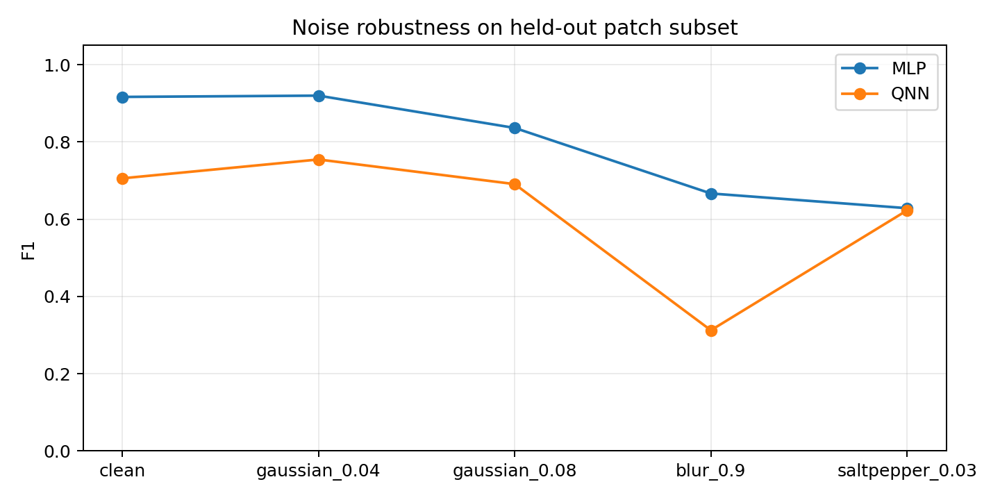
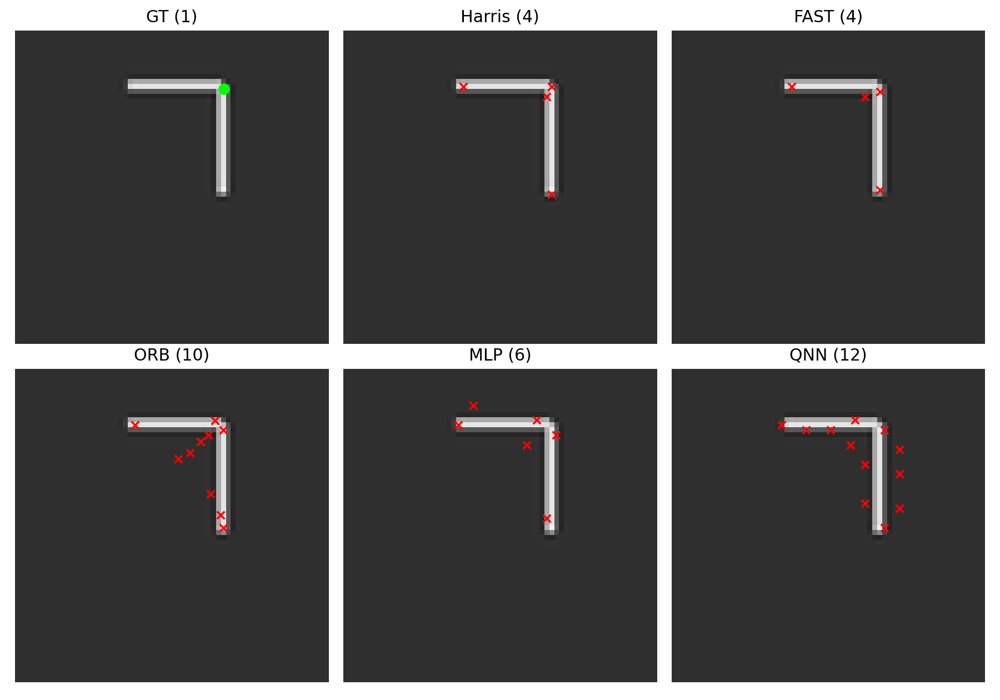

# QNN Improvement Experiments

## Main Improved Model

- Features: 8-D `[Ix, Iy, Ix2, Iy2, IxIy, lambda1, lambda2, R]`
- QNN: L=2, ring entanglement, RyRz, Z+ZZ readout, trainable input scaling
- MLP F1: 0.9453, PR-AUC: 0.9756
- Improved QNN F1: 0.7391, PR-AUC: 0.7909

## Key Figures

