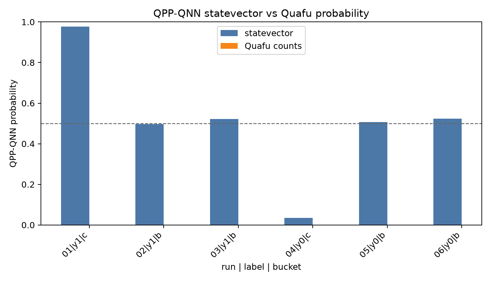

# QPP QNN to Quafu real-device experiment

- Created: 2026-06-30T21:51:09
- Model: `qpp_2q_lambda12_linear_L3_Z_ZZ`
- Backend chip: `Baihua`
- Shots per task: `1024`
- Dataset split: `test`
- Sample selection: `mixed`, `n_per_label=3`
- CSV: `quafu_qpp_qnn_batch_results.csv`
- JSON: `quafu_qpp_qnn_batch_results.json`

## Conversion path

1. Read one patch feature vector from the 5D dataset.
2. Keep only `lambda12 = [lambda1, lambda2]`, because the selected QPP QNN was trained on these two structure-tensor eigenvalue features.
3. Apply the train-split normalizer: `z = clip((lambda12 - mean) / std, -3, 3)` and map to circuit angles with `phi = pi * z / 3`.
4. Build the 2-qubit, 3-layer data-reuploading QPP circuit in Qiskit. Each layer applies `Ry(phi_j), Rz(phi_j)` on both qubits, then the trained `Rz-Ry-Rz` rotations, then `CX q[0], q[1]`.
5. Add measurements `q[0] -> c[0]` and `q[1] -> c[1]`, then export the circuit with `qiskit.qasm2.dumps(circuit)`.
6. Submit the OpenQASM string through Quafu's `quark.Task` API with a task dictionary containing `chip`, `name`, `circuit`, `compile`, and `shots`.
7. Convert returned bitstring counts back to observables. With Qiskit-style bitstrings, `q0` is the rightmost bit and `q1` is the second rightmost bit. A measured `0` contributes `+1` to Z and `1` contributes `-1`.
8. Reuse the trained affine readout head: `logit = w0 <Z0> + w1 <Z1> + w2 <Z0Z1> + b`, then `probability = sigmoid(logit)`.

## Aggregate result

- Selected tasks: `6`
- Finished with counts: `0`
- Failed or timed out: `6`
- Statevector accuracy on selected samples: `0.500`

## Per-task results

| run | idx | y | bucket | lambda1 | lambda2 | exact p | Quafu p | delta | pred exact/hw | counts |
|---:|---:|---:|---|---:|---:|---:|---:|---:|---|---|
| 1 | 308 | 1 | confident | 2.8588 | 1.2191 | 0.9766 |  |  | 1/ |  |
| 2 | 903 | 1 | borderline | 1.5532 | 0.3667 | 0.4963 |  |  | 0/ |  |
| 3 | 641 | 1 | borderline | 5.8799 | 0.9525 | 0.5213 |  |  | 1/ |  |
| 4 | 462 | 0 | confident | 0.0693 | 0.0000 | 0.0341 |  |  | 0/ |  |
| 5 | 1408 | 0 | borderline | 6.5167 | 0.2111 | 0.5066 |  |  | 1/ |  |
| 6 | 1264 | 0 | borderline | 1.8445 | 0.4120 | 0.5229 |  |  | 1/ |  |

## Figures

## Reading the result

The high-confidence samples are mainly a hardware sanity check: the Quafu-count probability should stay on the same side of the 0.5 decision threshold as the exact statevector result. Borderline samples are deliberately harder; small device noise, compilation differences, and finite-shot fluctuation can move them across the threshold.

This experiment therefore checks two things at once: whether the QPP-QNN circuit can be submitted as a Quafu task, and whether the classical QPP readout head can consume real-device bitstring counts without changing the trained model.